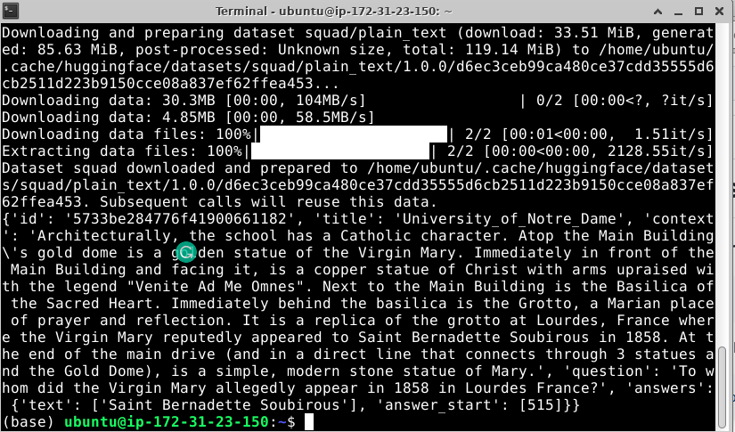

# OpenAI install


### Step 1) Install Anaconda with the GUI installer

* Download the Anaconda installer for your operating system from [here](https://www.anaconda.com/products/individual#Downloads). We recommend using the graphical installer.
* In Ubuntu, you can simply do this
```shell
sudo apt install libgl1-mesa-glx libegl1-mesa libxrandr2 libxrandr2 libxss1 libxcursor1 libxcomposite1 libasound2 libxi6 libxtst6
curl -O https://repo.anaconda.com/archive/Anaconda3-2024.02-1-Linux-x86_64.sh 
bash Anaconda3-2024.02-1-Linux-x86_64.sh
```
* Last install step: say **"yes"** to initializing Conda

## Close the terminals where you installed and open another one. 

### Step 2) Use conda environment

* Optional
* Create conda environment for all subsequent labs

```shell
conda create --name OpenAI  python=3.10.9
conda activate OpenAI
```

### Step 3) Install OpenAI

```shell
git clone https://github.com/elephantscale/OpenAI-labs.git
cd OpenAI-labs
./requirements-install.sh
```


### If also doing HuggingFace
### Step 4) Install Hugging Face

```bash
pip install transformers[torch]
```

### Step 5) Verify the installation

```bash
python -c "from transformers import pipeline; print(pipeline('sentiment-analysis')('I love you'))"
```

* You should see something like this

```text
[{'label': 'POSITIVE', 'score': 0.9998656511306763}]
``` 

#  Install Hugging Face datasets

### Step 6) Install datasets

```bash
pip install datasets
```

* Run the following command to check if 🤗 Datasets has been properly installed:

```bash
python -c "from datasets import load_dataset; print(load_dataset('squad', split='train')[0])"
```

* You should see something like this




