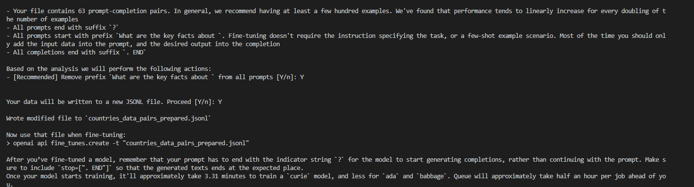
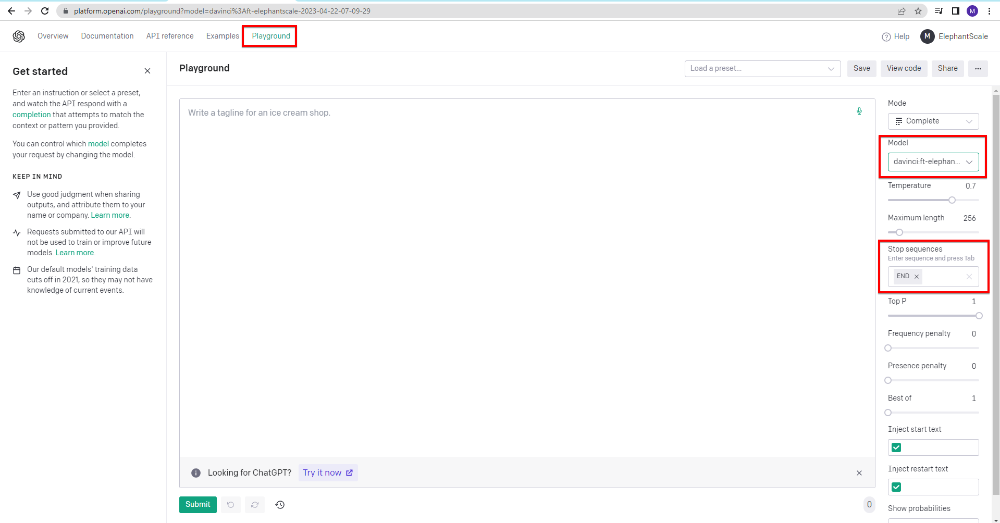
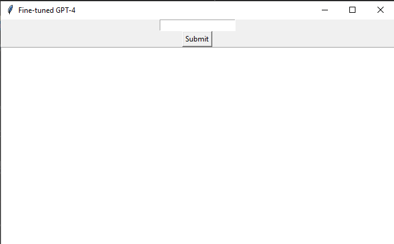

# Fine Tuning

https://platform.openai.com/docs/guides/fine-tuning

* In this lab we will practice fine-tuning an OpenAI model

### Lab Goals:

* Create a Dataset to fine-tune a ChatGPT-4 model
* Learn how to use the OpenAI command-line interface (CLI) to fine-tune models
* Learn how to format your data to fine-tune models

### Requirements:

1. Python installed on your machine
2. Valid OpenAI-API key
 
### STEP 1) Prepare your Dataset
https://platform.openai.com/docs/guides/fine-tuning/data-formatting

* To fine-tune a model, you'll need a set of training examples that each consist of a single input ("prompt") and its associated output ("completion")

* For this lab we will create a dataset using ChatGPT

* We used to following prompt in the ChatGPT4 window

``` text
Write a Python script that creates a CSV with the following columns.
Country, Population, Language, PIB, IPC, Weather, Flag Colors, Religion, Poverty %, President

Create a sample of 10 countries with the data on the headers
```

- The python script returned by ChatGPT 

``` python
import csv
import random

# Sample data for each column
countries = ["United States", "China", "Russia", "Brazil", "India", "Canada", "Mexico", "France", "Germany", "Japan", "Australia", "South Korea", "Egypt", "Nigeria", "South Africa","Spain", "Italy", "Netherlands", "Argentina", "Chile", "Thailand", "Indonesia", "Poland", "Sweden", "Switzerland", "Norway", "Finland", "Denmark", "Ireland", "Portugal", "Austria", "Belgium", "Greece", "Czech Republic", "Hungary"]
populations = [331000000, 1386000000, 144400000, 213000000, 1390000000,37742154, 130222814, 67413000, 83190556, 126476461, 25687041, 51709098, 104258327, 211400708, 60041925, 46754778, 60252824, 17173000, 45376763, 19458310, 69799978, 271350000, 38476957, 10175214, 8715625, 5367580, 5540720, 5818553, 4982900, 10276617, 8917205, 11589623, 10746740, 10708981, 9745900]
languages = ["English", "Mandarin", "Russian", "Portuguese", "Hindi, English", "English, French", "Spanish", "French", "German", "Japanese", "English", "Korean", "Arabic", "English", "Zulu, Xhosa, Afrikaans", "Spanish", "Italian", "Dutch", "Spanish", "Spanish", "Thai", "Indonesian", "Polish", "Swedish", "German, French, Italian, Romansh", "Norwegian", "Finnish", "Danish", "English, Irish", "Portuguese", "German", "Dutch, French, German", "Greek", "Czech", "Hungarian"]
PIB = [21433204, 14342903, 1699861, 2143872, 3054218, 1737177, 1212241, 2844985, 4135497, 5172526, 1532089, 1782355, 303626, 448125, 296219, 1368196, 2108546, 912924, 451338, 298796, 543605, 1130441, 614319, 538957, 705874, 403212, 236225, 306118, 393875, 230427, 482842, 528207, 209853, 248625, 173025]
IPC = [63.4, 8.3, 11.2, 10.1, 7.3, 10.9, 8.3, 8.9, 9.6, 9.9, 7.4, 10.7, 4.0, 1.9, 4.1, 8.6, 8.5, 10.4, 9.9, 7.1, 4.7, 4.1, 7.2, 10.2, 9.0, 11.0, 10.7, 10.6, 10.9, 9.5, 9.9, 10.2, 8.2, 9.5, 9.7]
weather = ["Temperate", "Temperate", "Temperate", "Tropical", "Tropical", "Temperate", "Tropical", "Temperate", "Temperate", "Temperate", "Temperate", "Temperate", "Desert", "Tropical", "Temperate", "Mediterranean", "Mediterranean", "Temperate", "Temperate", "Temperate", "Tropical", "Tropical", "Temperate", "Temperate", "Temperate", "Temperate", "Temperate", "Temperate", "Temperate", "Mediterranean", "Temperate", "Temperate", "Mediterranean", "Temperate", "Temperate"]
flag_colors = ["Red, White, Blue", "Red, Yellow", "White, Blue, Red", "Green, Yellow, Blue", "Saffron, White, Green", "Red, White", "Green, White, Red", "Blue, White, Red", "Black, Red, Gold", "White, Red", "Blue, White, Red", "White, Black, Red", "Black, White, Red", "Green, White, Green", "Black, White, Green", "Red, Yellow", "Green, White, Red", "Red, White, Blue", "Blue, White", "Red, White, Blue", "Red, White, Blue", "Red, White", "White, Red", "Blue, Yellow", "Red, White", "Red, White, Blue", "Blue, White", "Red, White", "Green, White, Orange", "Green, Red", "Red, White, Red", "Black, Yellow, Red", "Blue, White", "Red, White, Blue", "Red, White, Green"]
religion = ["Christianity", "Irreligion, Buddhism, Taoism, Confucianism", "Russian Orthodoxy", "Roman Catholicism", "Hinduism, Islam", "Christianity", "Catholicism", "Christianity", "Christianity", "Shintoism, Buddhism", "Christianity", "Christianity, Buddhism", "Islam", "Christianity", "Christianity", "Christianity", "Christianity", "Christianity", "Christianity", "Christianity", "Buddhism", "Islam", "Christianity", "Christianity", "Christianity", "Christianity", "Christianity", "Christianity", "Christianity", "Christianity", "Christianity", "Christianity", "Christianity", "Christianity", "Christianity"]
poverty_percent = [9.2, 3.1, 12.3, 21.2, 21.9, 9.5, 41.9, 8.5, 14.8, 16.1, 13.6, 13.5, 32.5, 40.1, 25.2, 21.5, 10.9, 8.6, 32.0, 8.6, 7.8, 9.2, 3.5, 8.3, 6.2, 4.6, 5.5, 6.2, 12.8, 17.3, 3.3, 6.0, 34.0, 9.6, 11.6]
president = ["Joe Biden", "Xi Jinping", "Vladimir Putin", "Jair Bolsonaro", "Ram Nath Kovind", "Justin Trudeau", "Andrés Manuel López Obrador", "Emmanuel Macron", "Frank-Walter Steinmeier", "Naruhito", "Scott Morrison", "Moon Jae-in", "Abdel Fattah el-Sisi", "Muhammadu Buhari", "Cyril Ramaphosa", "Pedro Sánchez", "Sergio Mattarella", "Mark Rutte", "Alberto Fernández", "Sebastián Piñera", "Maha Vajiralongkorn", "Joko Widodo", "Andrzej Duda", "Stefan Löfven", "Guy Parmelin", "Halldór Ásgrímsson", "Sauli Niinistö", "Mette Frederiksen", "Michael D. Higgins", "Marcelo Rebelo de Sousa", "Alexander Van der Bellen", "Philippe of Belgium", "Katerina Sakellaropoulou", "Miloš Zeman", "János Áder"]

# Write data to CSV
with open("sample_data.csv", "w", newline="") as csvfile:
    writer = csv.writer(csvfile)
    writer.writerow(["Country", "Population", "Language", "PIB", "IPC", "Weather", "Flag Colors", "Religion", "Poverty %", "President"])
    for i in range(len(countries)):
        writer.writerow([countries[i], populations[i], languages[i], PIB[i], IPC[i], weather[i], flag_colors[i], religion[i], poverty_percent[i], president[i]])

```

* Run the script. As result, you will have a csv as the following

[Countries.csv](https://github.com/elephantscale/OpenAI-labs/blob/09f74455f331e6d51af65782f9556e084513002c/02%20-%20Fine%20Tunning/countries.csv)

### STEP 2) Create JSONL file to fine-tune the model

- We will use ChatGpt again to create a Python script that will create the JsonL file to train the model.

- First we will give context to ChatGpt using the following prompt

``` 
I have a spreadsheet of countries data. 

These are the column headings in csv format:
Country,Population,Language,PIB,IPC,Weather,Flag Colors,Religion,Poverty %,President


Here are example rows of data in csv format:
United States,331000000,English,21433204,63.4,Temperate,"Red, White, Blue",Christianity,9.2,Joe Biden
China,1386000000,Mandarin,14342903,8.3,Temperate,"Red, Yellow","Irreligion, Buddhism, Taoism, Confucianism",3.1,Xi Jinping
Russia,144400000,Russian,1699861,11.2,Temperate,"White, Blue, Red",Russian Orthodoxy,12.3,Vladimir Putin
Brazil,213000000,Portuguese,2143872,10.1,Tropical,"Green, Yellow, Blue",Roman Catholicism,21.2,Jair Bolsonaro
India,1390000000,"Hindi, English",3054218,7.3,Tropical,"Saffron, White, Green","Hinduism, Islam",21.9,Ram Nath Kovind
Canada,37742154,"English, French",1737177,10.9,Temperate,"Red, White",Christianity,9.5,Justin Trudeau
Mexico,130222814,Spanish,1212241,8.3,Tropical,"Green, White, Red",Catholicism,41.9,Andres Manuel Lopez Obrador

Do you understand?
```

- Then we ask to create the python script

``` 
I want to use this data to fine tune GPT4. 

Write me a python script to create prompt and completion pairs in this format:
{"prompt": "<prompt text>", "completion": "<ideal generated text>"}
{"prompt": "<prompt text>", "completion": "<ideal generated text>"}
{"prompt": "<prompt text>", "completion": "<ideal generated text>"}

I want each completion to contain a written summary of all data for that country using string interpolation. 

Use END as the stop sequence in the completion

The prompt and completion pairs need to be exported to a jsonL file.
``` 

- The python script returned by ChatGPT

``` python
import csv
import json

# Load the data from the CSV file
data = []
with open('countries.csv') as csv_file:
    csv_reader = csv.DictReader(csv_file)
    for row in csv_reader:
        data.append(row)

# Generate prompt and completion pairs for each country
pairs = []
for row in data:
    prompt = f"What are the key facts about {row['Country']}?"
    completion = f" {row['Country']} is a country with a population of {row['Population']} and the official language is {row['Language']}. The country has a GDP of {row['PIB']} and a per capita income of {row['IPC']}. The climate in {row['Country']} is {row['Weather']}. The flag of {row['Country']} has the colors {row['Flag Colors']}. The predominant religion in {row['Country']} is {row['Religion']} and the poverty rate is {row['Poverty %']}. The current president is {row['President']}. END"
    pairs.append({"prompt": prompt, "completion": completion})

# Export the prompt and completion pairs to a jsonL file
with open('countries_data_pairs.jsonl', 'w') as json_file:
    for pair in pairs:
        json.dump(pair, json_file)
        json_file.write('\n')    
```

- Run the script. As result, you will have a jsonl file as the following

[countries_data_pairs.jsonl](https://github.com/elephantscale/OpenAI-labs/blob/d39ce7caeed2ffd9e6870dd2749c868c3d9e7a27/02%20-%20Fine%20Tunning/countries_data_pairs.jsonl)

### STEP 3) Create a fine-tuned model

* Install OpenAI command-line interface (CLI). To install this, run

``` bash
pip install --upgrade openai
```

* Set your OPENAI_API_KEY environment running the following command

``` bash
export OPENAI_API_KEY="<OPENAI_API_KEY>"
```

Note: Replace <OPENAI_API_KEY> with the API key provided

* Install pandas package

``` bash
pip install --upgrade pandas
```

* Using the CLI data preparation tool we will validate and get suggestions and reformats your data. Run the following command

``` bash
openai tools fine_tunes.prepare_data -f countries_data_pairs.jsonl     
```

* The CLI data preparation tool will suggest changes on your Jsonl file.



* As a result a new JsonL file will be created with the suffix prepared. 

_countries_data_pairs_prepared.jsonl_

* Start your fine-tuning job using the OpenAI CLI:

``` bash 
 openai api fine_tunes.create -t countries_data_pairs_prepared.jsonl -m <BASE_MODEL> --suffix "<CUSTOM_MODEL_NAME>"
```

* Where BASE_MODEL is the name of the base model you're starting from (ada, babbage, curie, or davinci). 
We recommend use davinci as it is considered to be the stronger model and you will get better results.

* You can customize your fine-tuned model's name using the suffix parameter.
* You can add a suffix of up to 40 characters to your fine-tuned model name.

### STEP 4) Test your fine-tuned model

* Once the fine-tuning is complete you can test your model using either the Playground tool provided by Open AI or using the API.

#### 1. Using the Playground 

* Go to https://platform.openai.com/playground. 
  * Select the fine-tuned model created
  * In the Stop Sequence put the token used in your data model. In this lab we use _END_.
    * (Please read https://platform.openai.com/docs/guides/fine-tuning/data-formatting)



#### 2. If you do not have access to the playground you can use the following Application Script (GUI):

* Replace FINE_TUNED_MODEL with the name of your fine-tuned model

```python
import tkinter as tk
import openai


# Replace FINE_TUNED_MODEL with the name of your fine-tuned model
model_name = "FINE_TUNED_MODEL"


def on_submit():
   prompt = input_field.get()
   completion = openai.Completion.create(model=model_name, prompt=prompt, max_tokens=256, stop=["END"])
   input_field.delete(0, "end")
   text = completion.choices[0]["text"]
   result_text.config(state="normal")
   result_text.delete("1.0", "end")
   result_text.insert("end", text)
   result_text.config(state="disabled")
window = tk.Tk()
window.title("Fine-tuned GPT-3")

input_field = tk.Entry(window)
submit_button = tk.Button(window, text="Submit", command=on_submit)

result_text = tk.Text(window, state="normal", width=80, height=20)

input_field.pack()
submit_button.pack()
result_text.pack()

window.mainloop()
``` 



## Congratulations, you have fine-tuned your first model!