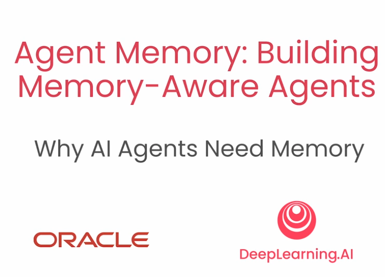
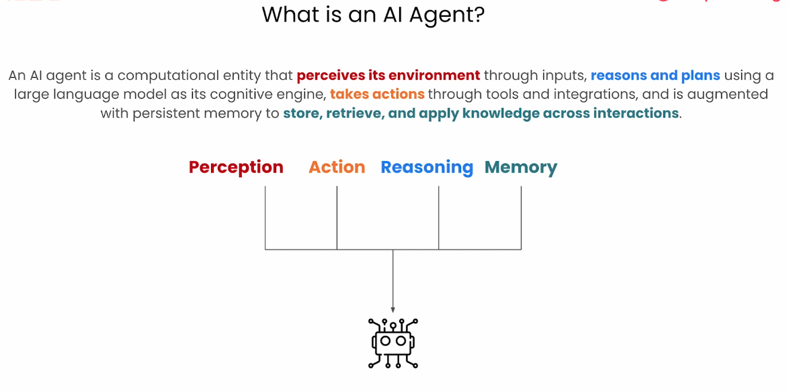
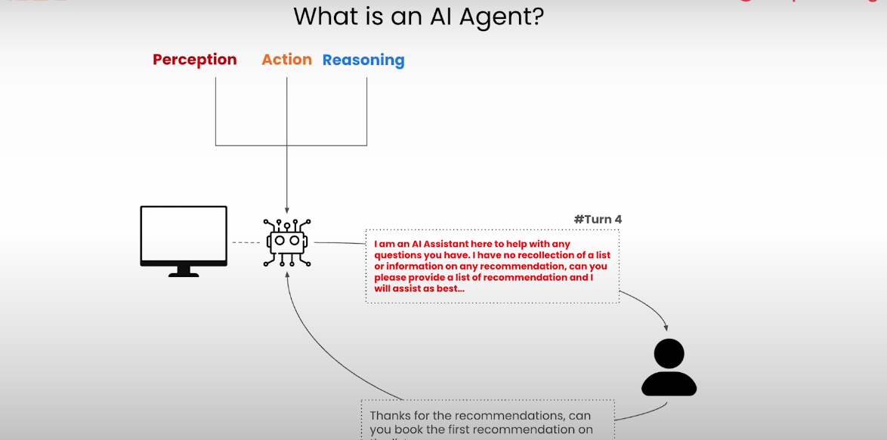
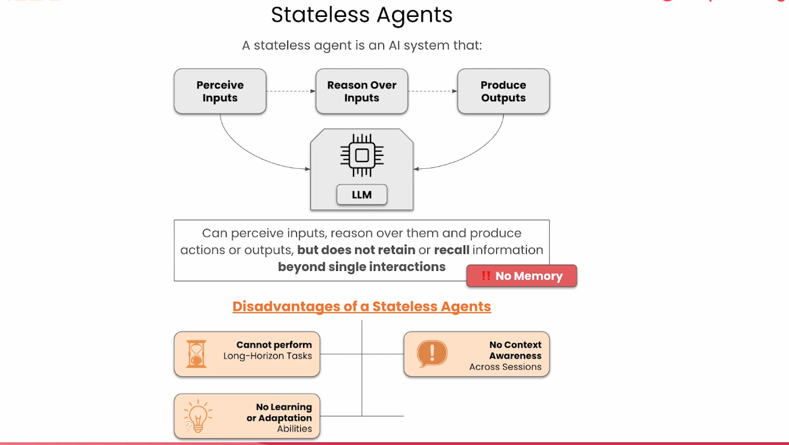
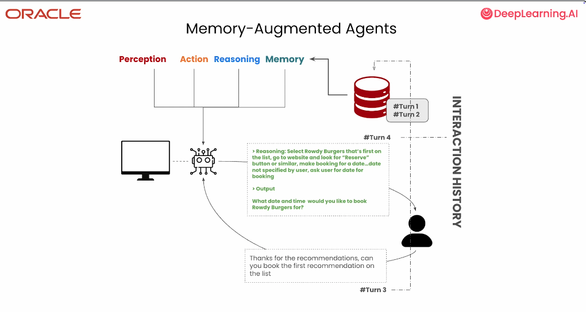

# Memory

---

# Why memory

---

# What we need to know

---

# What is an agent?

---

# Agent and Memory

---

# Agent without Memory

---

# Stateless agent 

---

# Memory and agent 

---

# Memory-augmented agent 

---