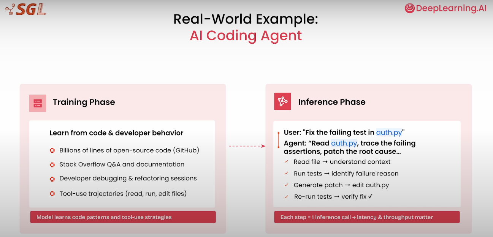
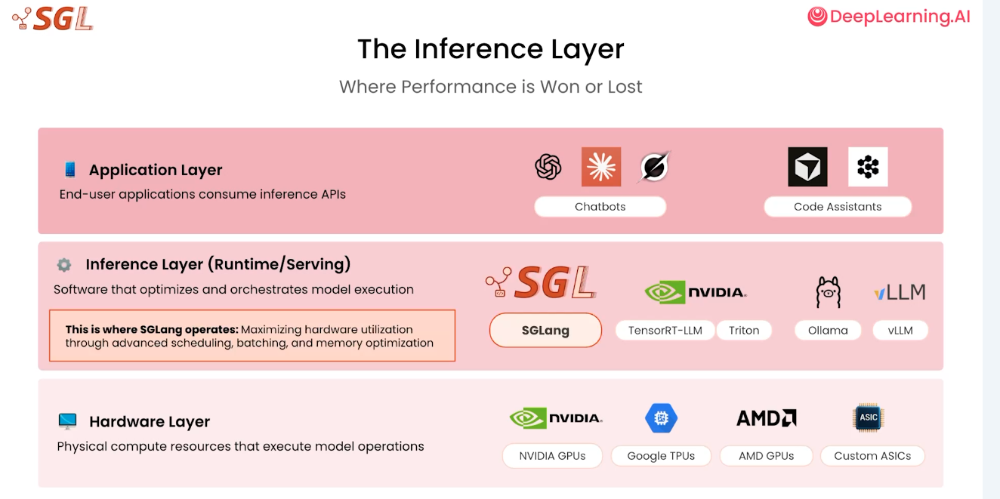
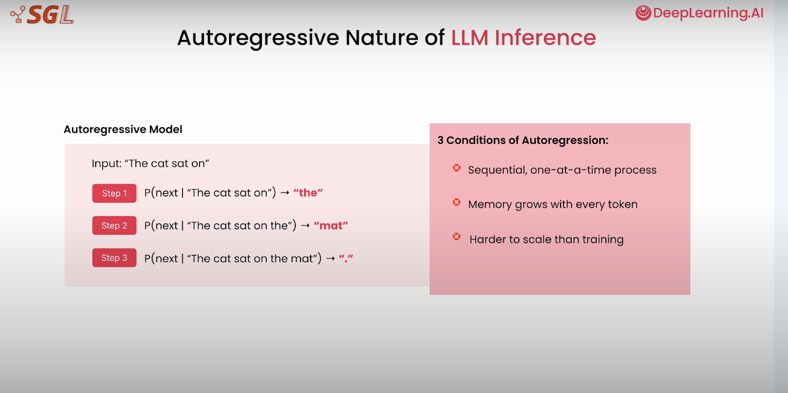
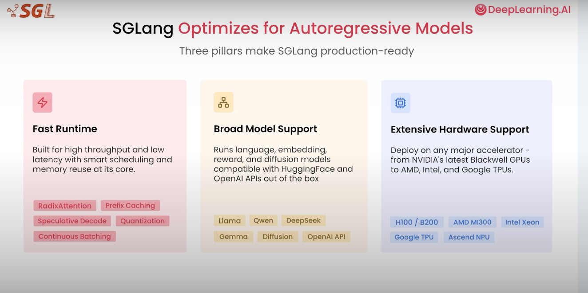
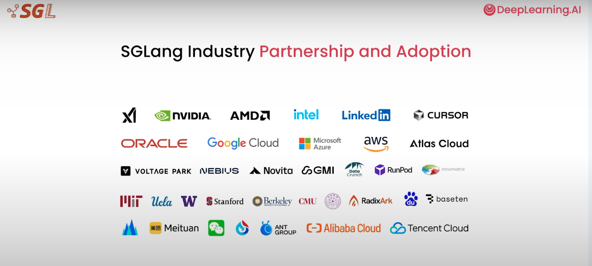
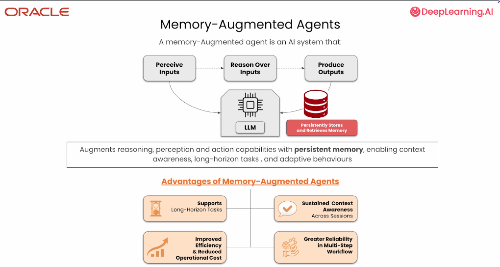

# SGLang

---

# Training and inference

---

# Reality

---

# Main idea

---

# Practically

---

# Why inference is hard

---

# SQLang works everywhere

---

# Everyone is using it

---

# Memory-augmented agent 

---