# Code review with QoDo

---

# Who

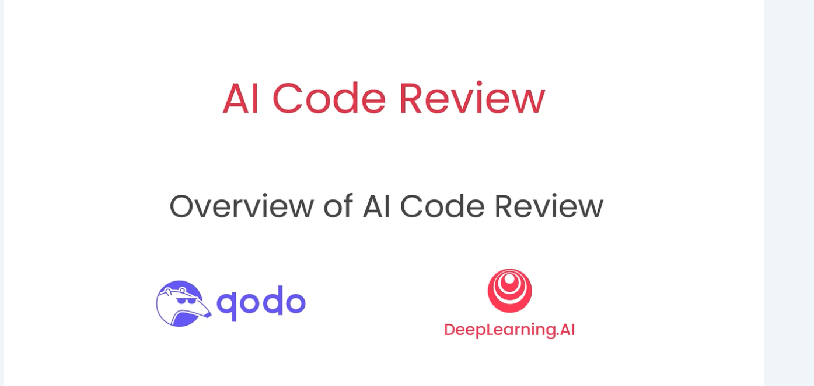

---

# Why

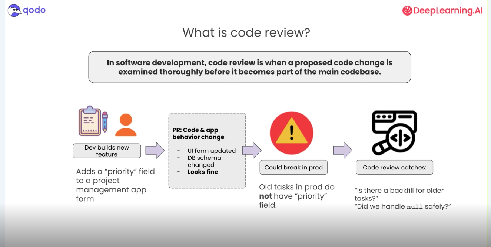

---

# What

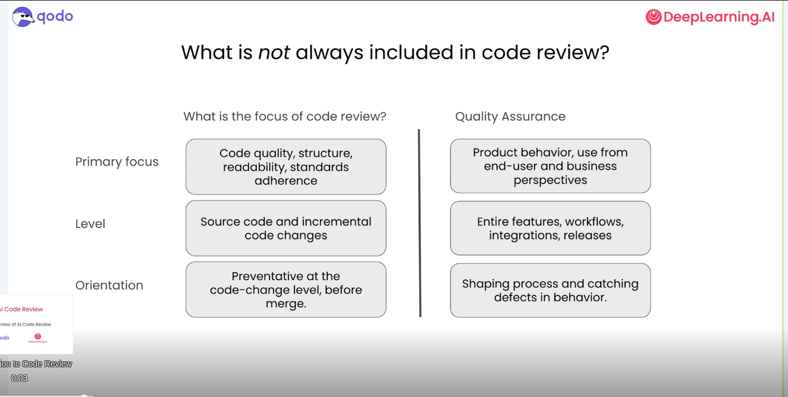

---

# How

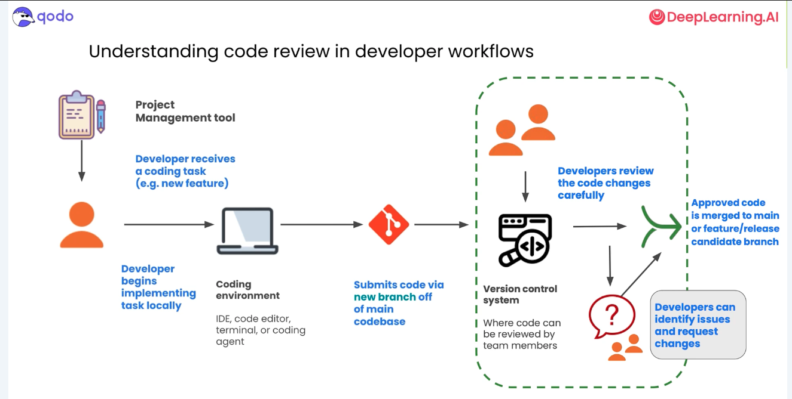

---

# Human - AI

---

# I don't get it!

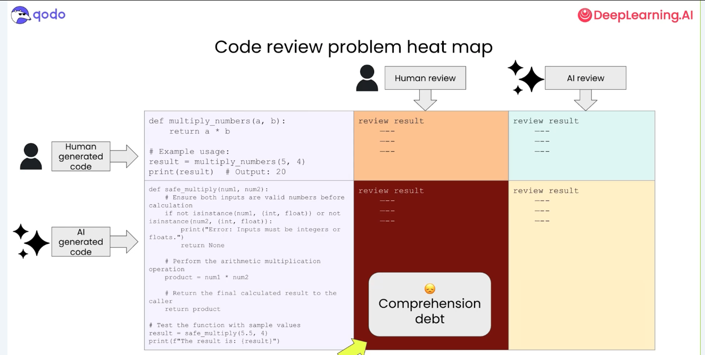

---

# Hope

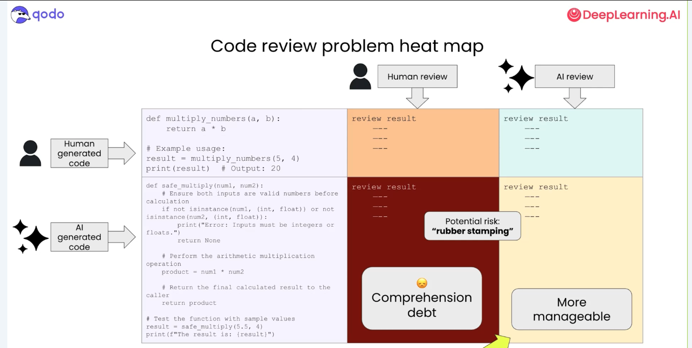

---

# Humans are good

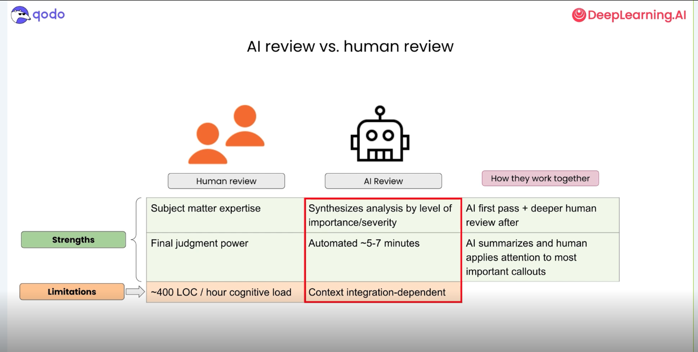

---

# What is needed for AI

---

# Together

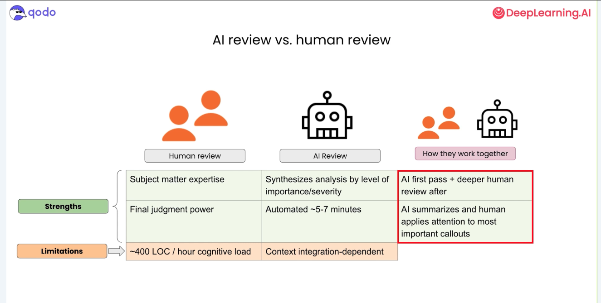

---

# Done!

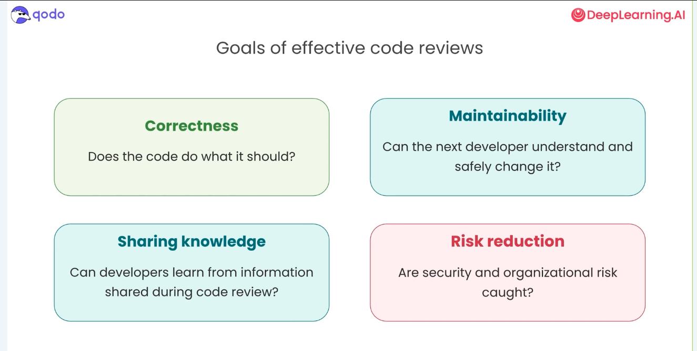

---

# Details

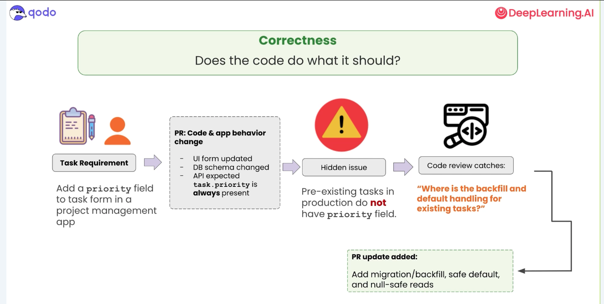

---

# Details

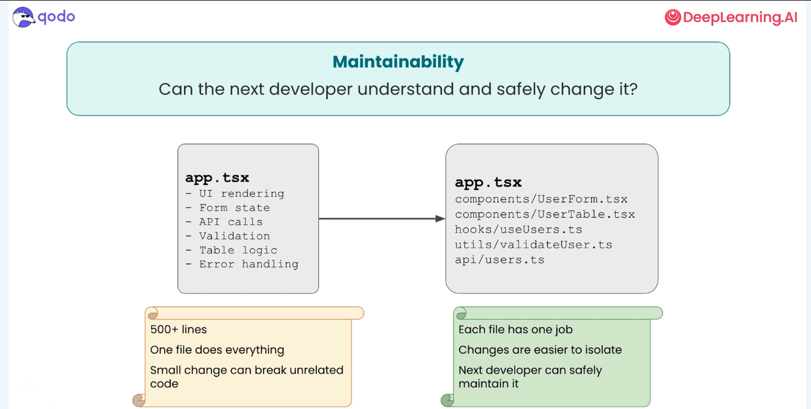

---

# Learning and sharing

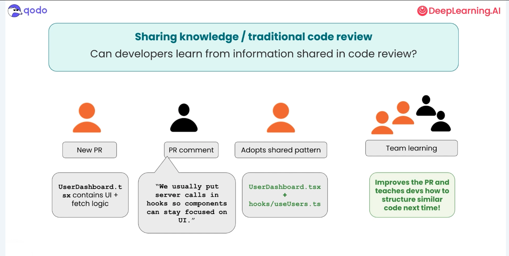

---

# Learning and sharing with AI

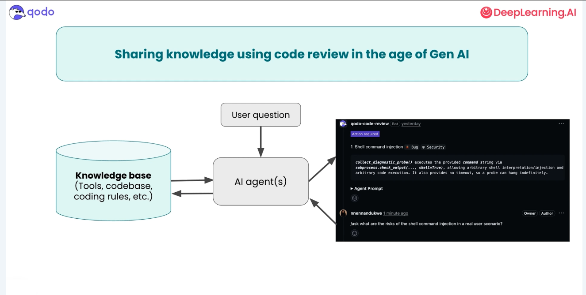

---

# Risk

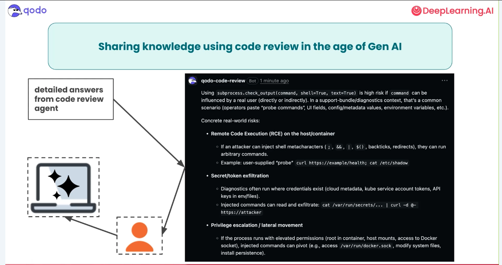

---

# More secure

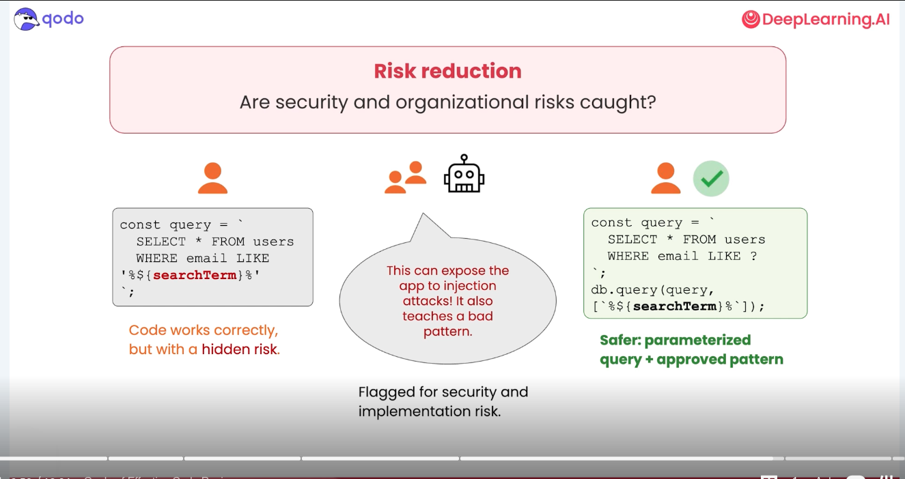

---

# Hidden praise

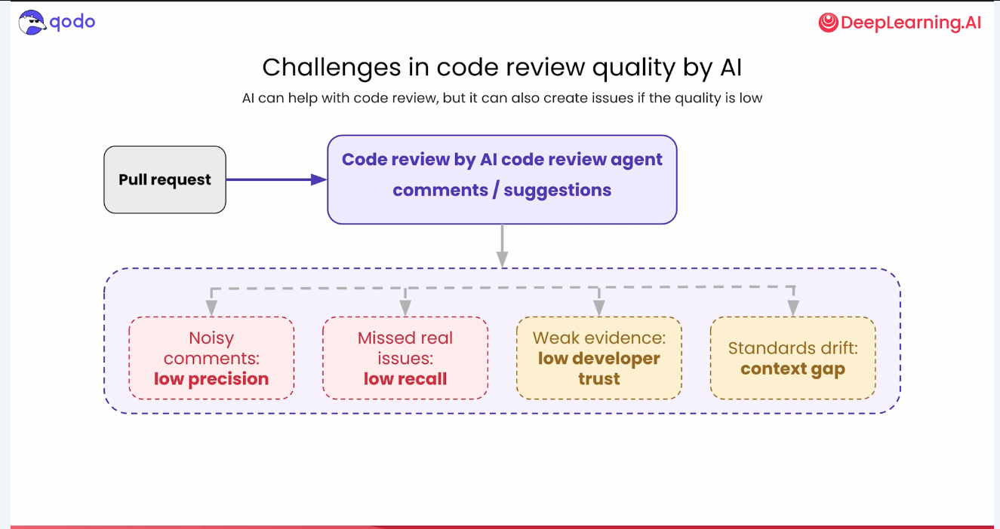

---

# Bravo!

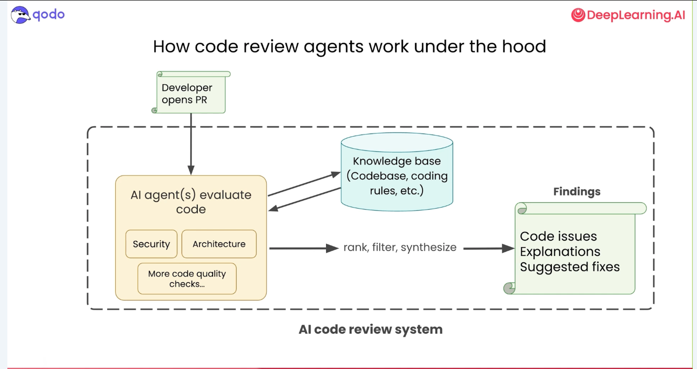

---

