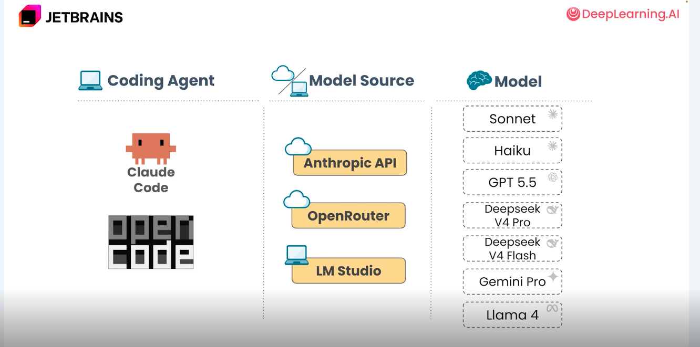
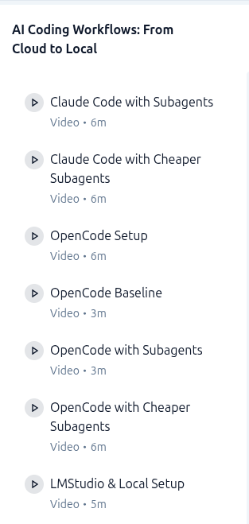
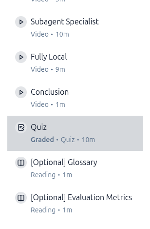

# Building Adequate AI Agents

---

# Overview

---

# Not remembering mistakes is bad

---

# So, how much

---

# But if you remember

---

# Here we turn

---

# Then split

---

# And local

---

# Now compare

---

# Choices

---

# You are an Ace

---

# Phase 1

---

# Phase 2

---
