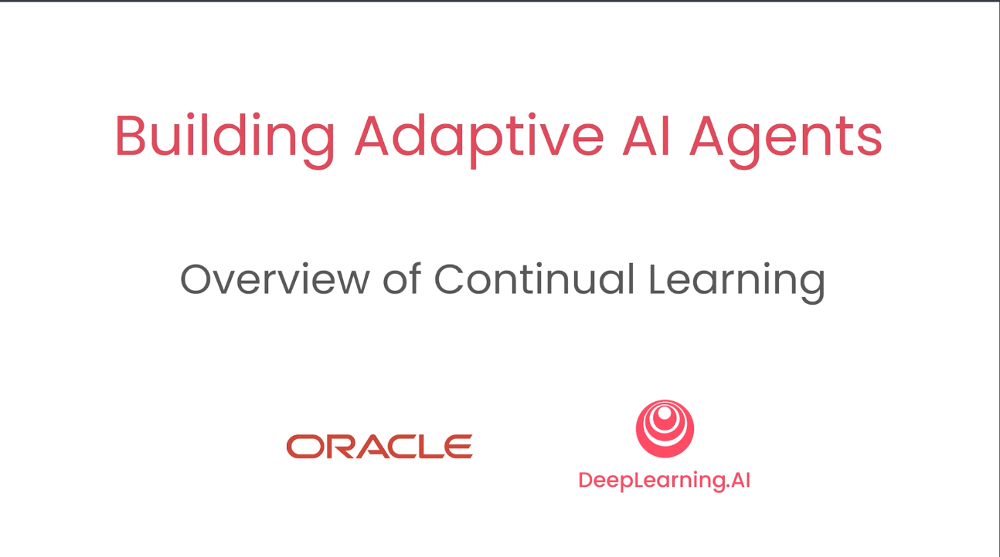
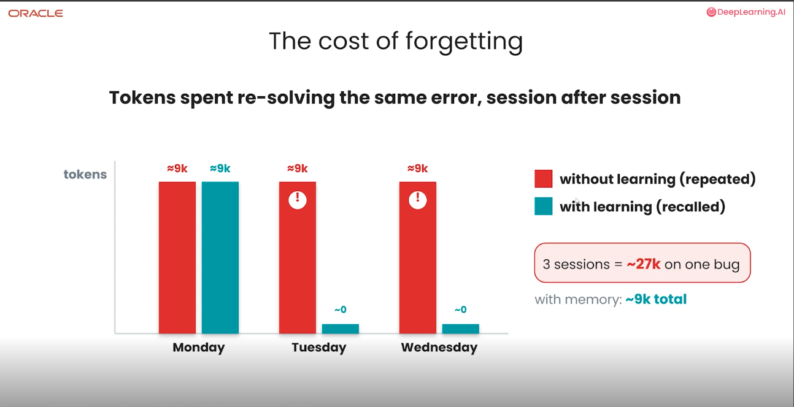
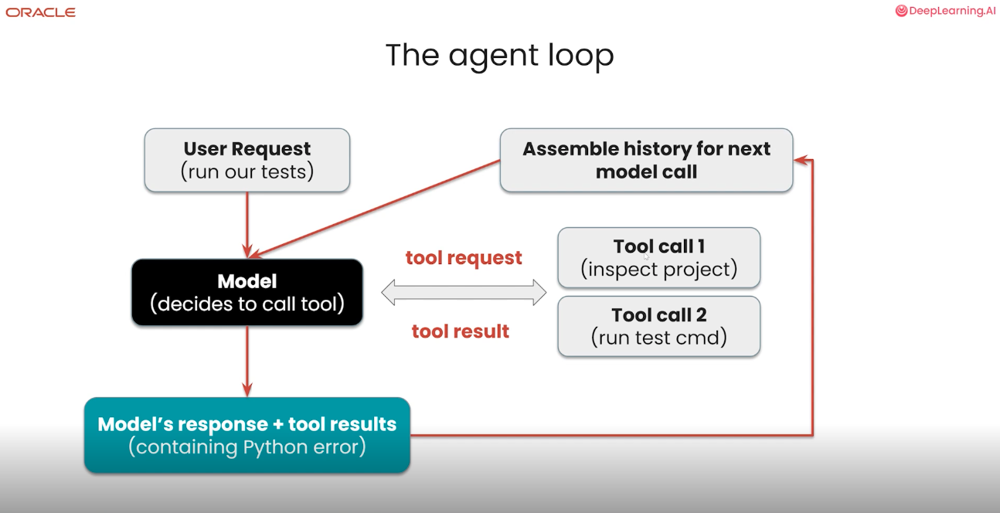
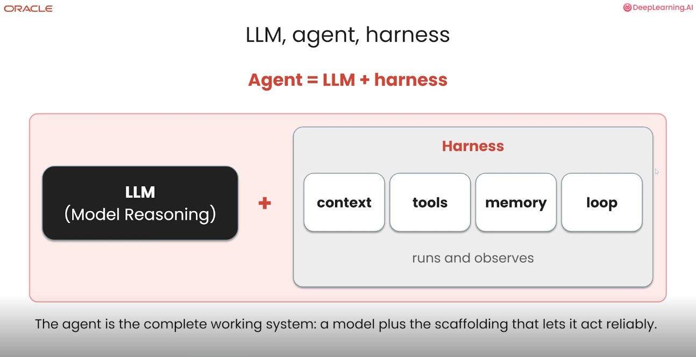
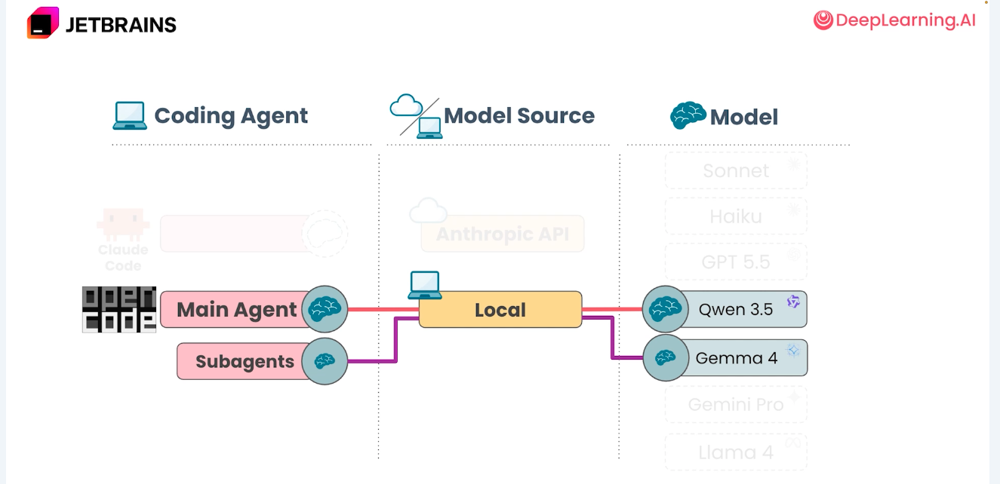
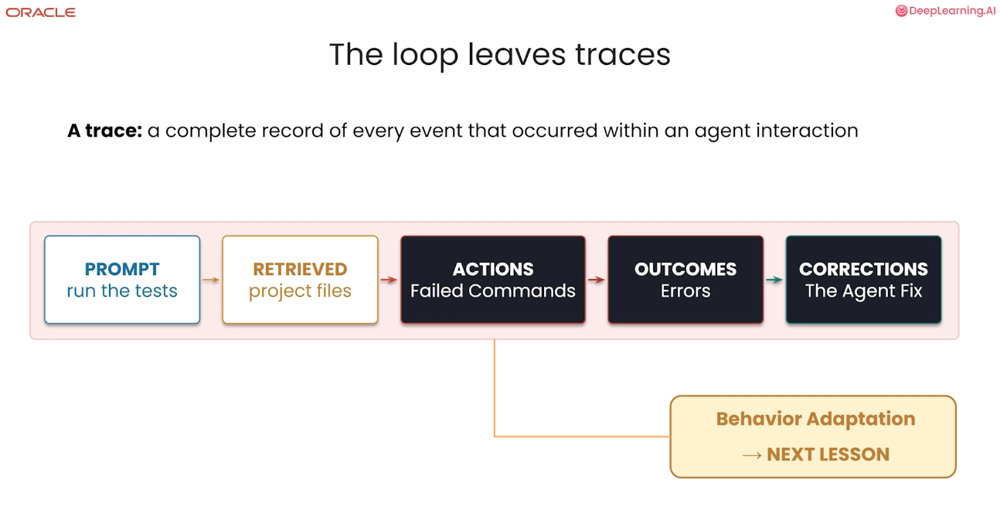
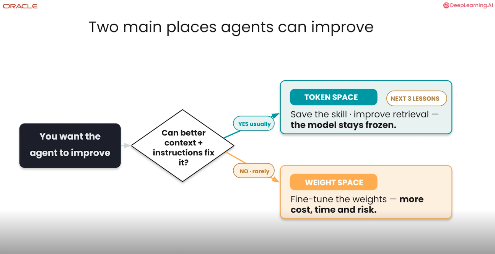

# Building Adaptive AI Agents

---

# Overview

---

# Not remembering mistakes is bad

---

# So, how much?

---

# But what is an agent?

---

# Agentic loop

---

# When does it stop?

---

# Here is Oracle!

---

# What to remember, by type

---

# How to remember

---

# Next steps

---
