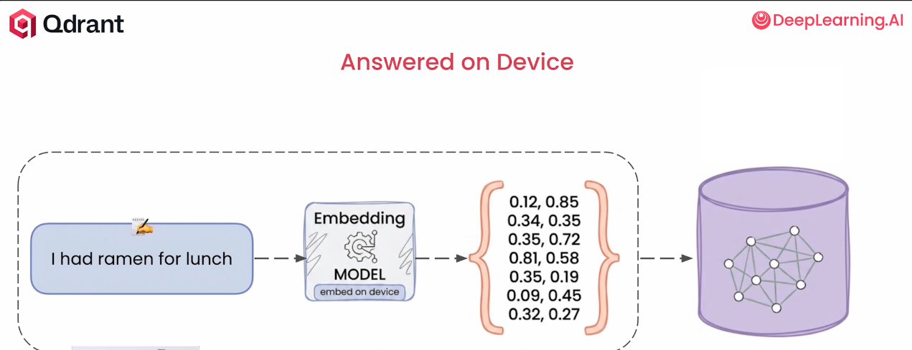
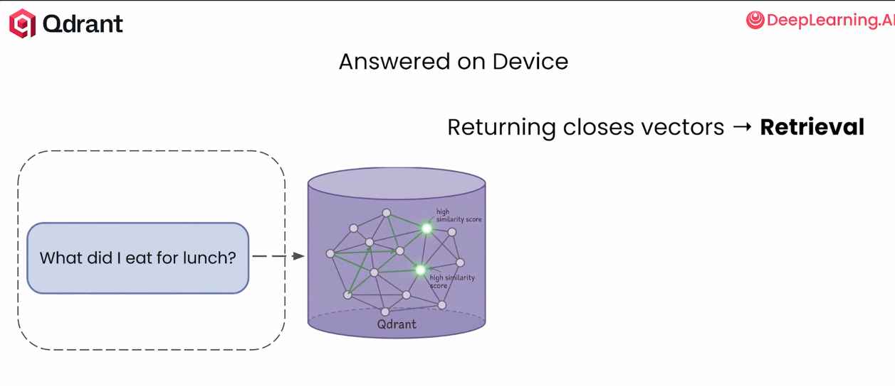
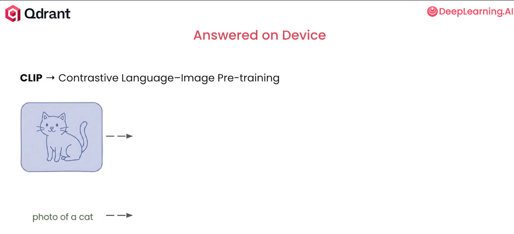
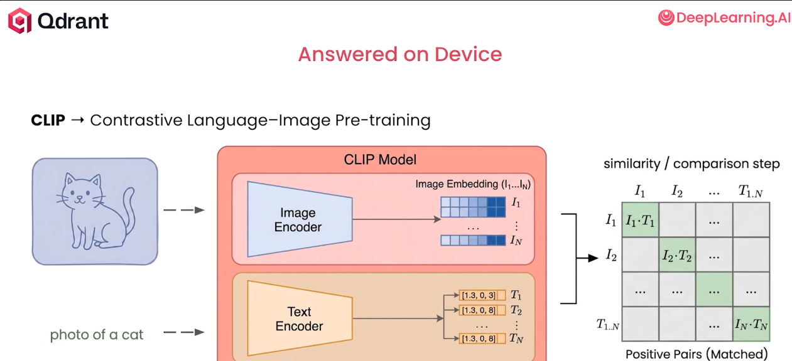
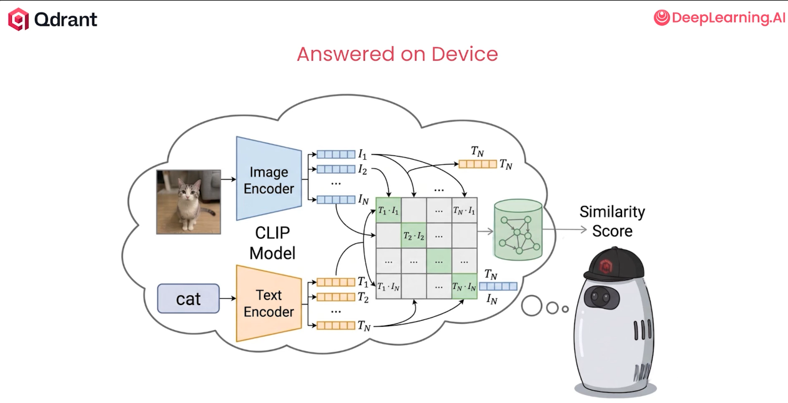
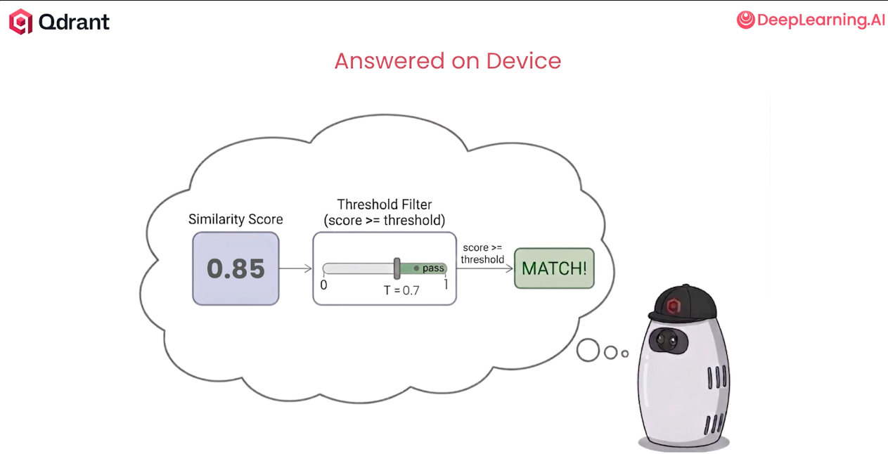

# Building AI Assistants with On-Device Memory

---

# Use case

---

# Local memory

---

# Local model

---

# Show it

---

# On device memory

---

# When does it stop?

---

# 

---

# 

---
