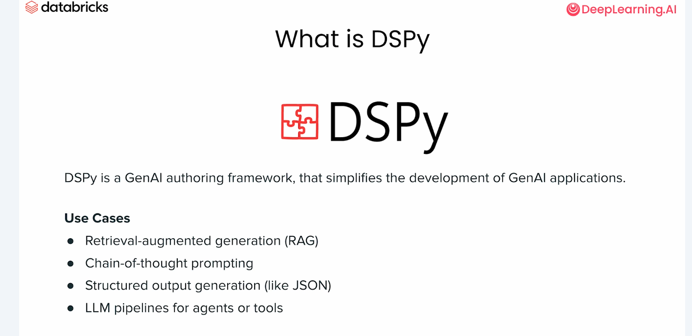
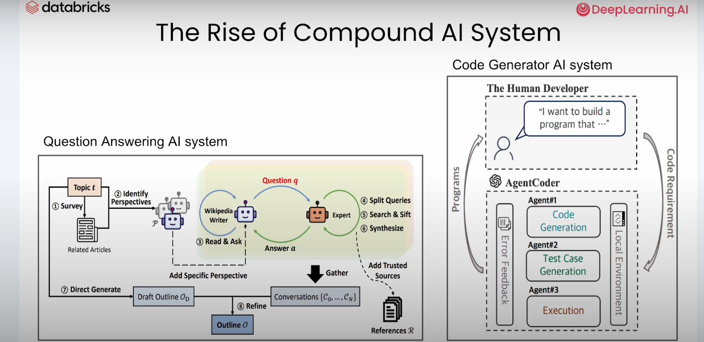
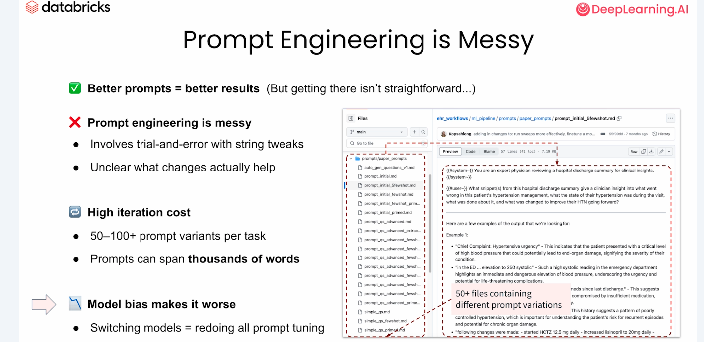
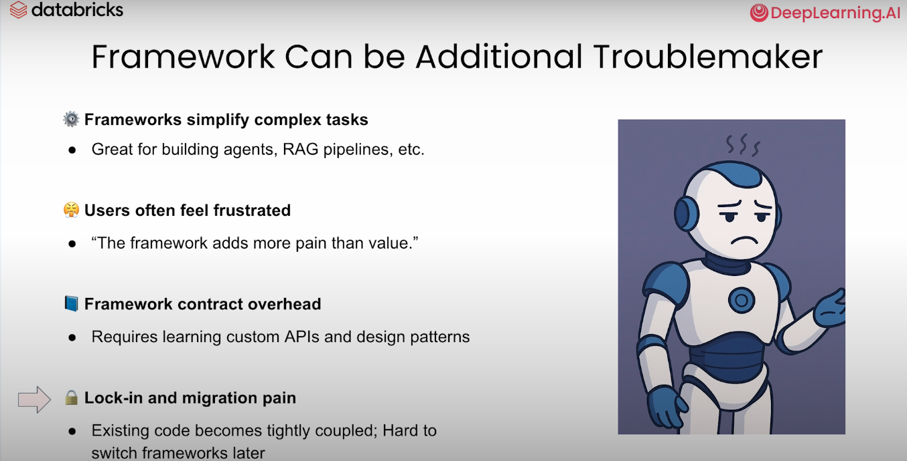
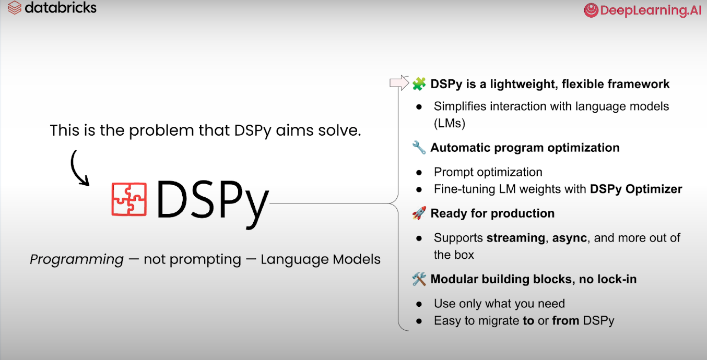
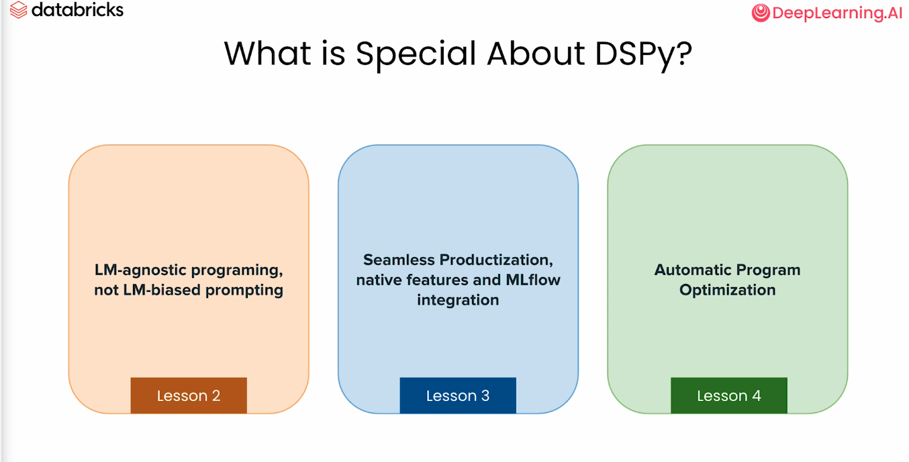
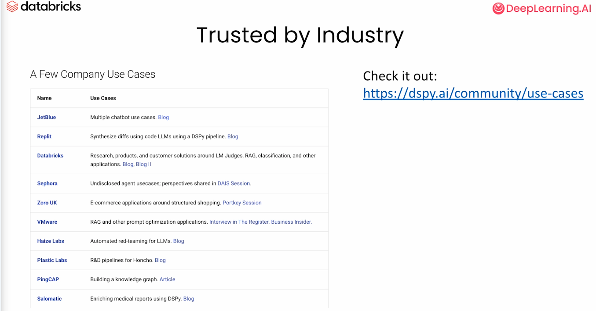

# DSPy intro

---

## What is DSPy?

 

---

## Build a system

 

---

## Prompt engineering is messy

 

---

## Frameworks?

 

---

## Comes DSPy

 

---

## DSPy?

 

---

## Users

 

---

## DSPy

* **Declarative** – you declare what transformation you want (question → answer, text → summary) rather than hand-write prompts.

* **Self-Improving** – the compiler automatically collects demonstrations, tunes prompts, or fine-tunes weights until a metric is maximised.

* **Python(ic)** – everything is plain Python code and modules, so you can compose LLM “layers” the way you compose neural-network layers.

* One-sentence takeaway
  * Think of DSPy as the Pythonic evolution of the original DSP idea—so its name memorialises both its Demonstrate-Search-Predict heritage and its goal of writing Declarative Self-Improving Python programs.
  * **DSP** began life in late 2022 as the Demonstrate-Search-Predict pipeline for retrieval-augmented LLMs.
---

