# Post-training-LLM

---

## Pre-train

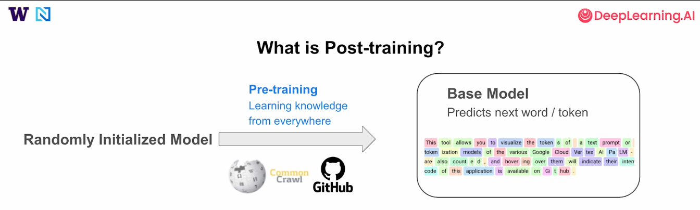 

---

## Post-train

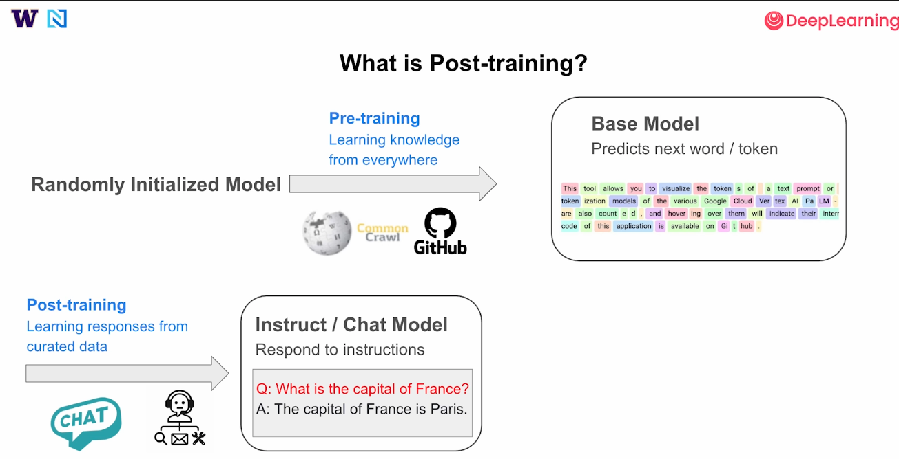 

---

## Post-post-train

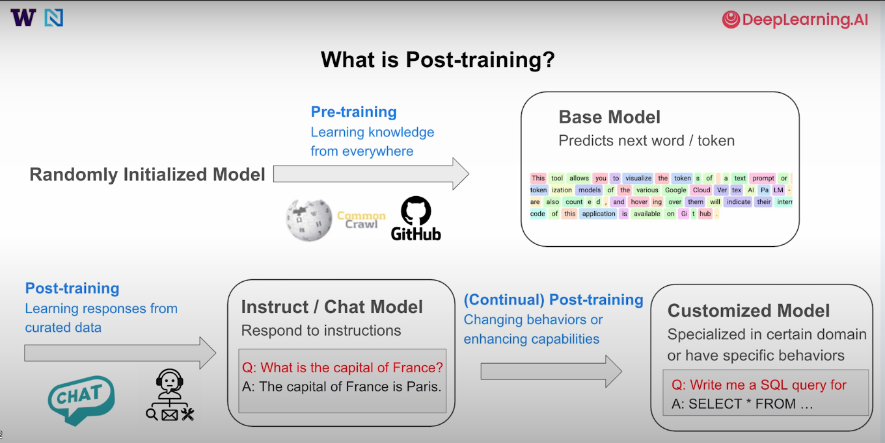 

---

## Methods

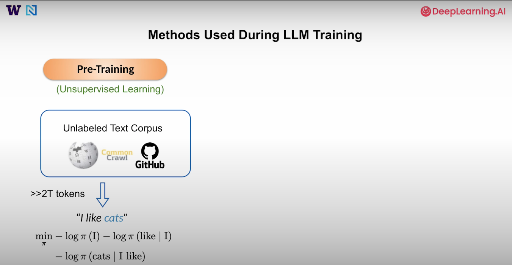 

---

## Context

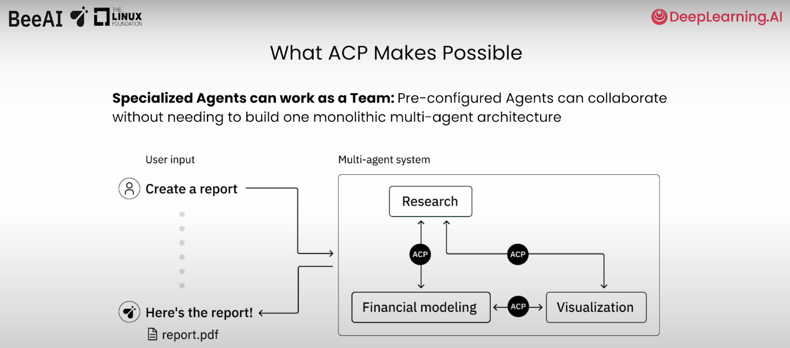 

---

## Use cases

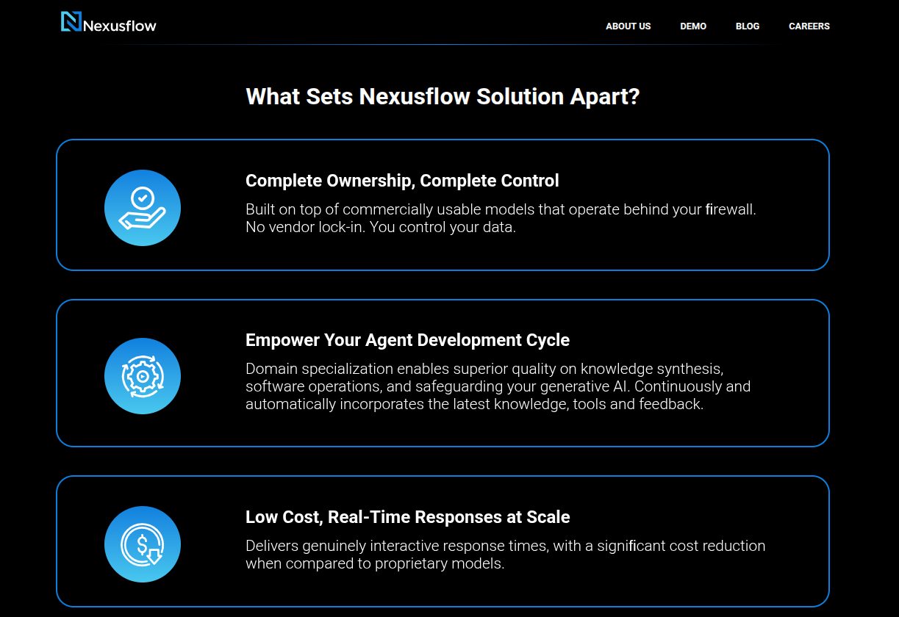 

---

## SFT

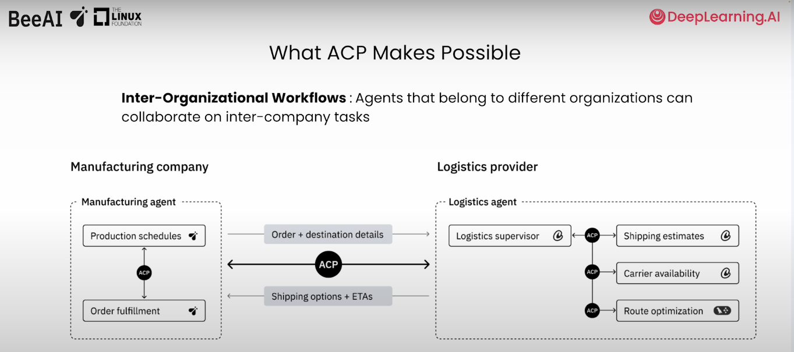 

---

## DPO

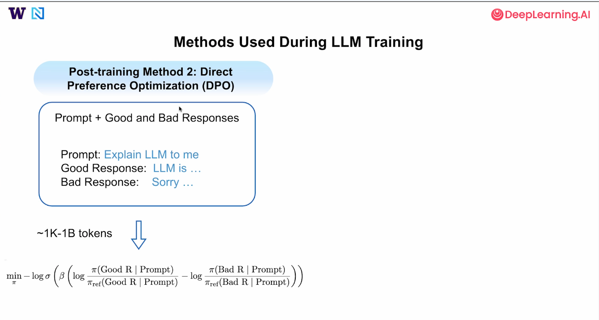 

---

## Online Reinforcement Learning

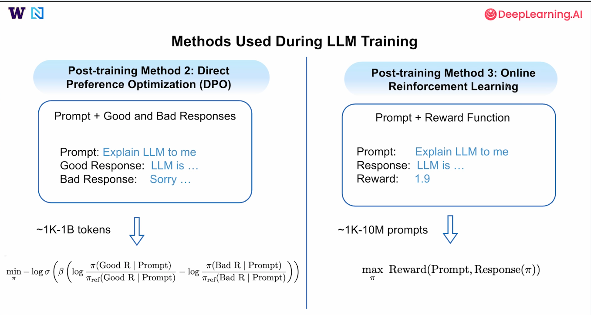 

---

## Various post training

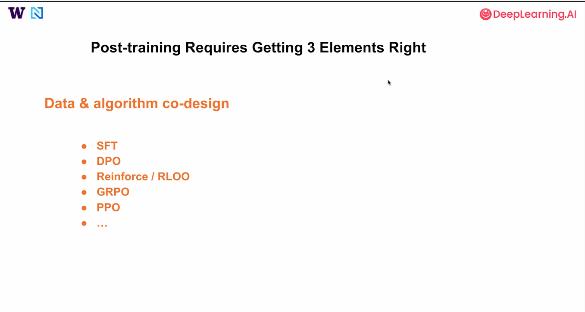 

---

## TRL

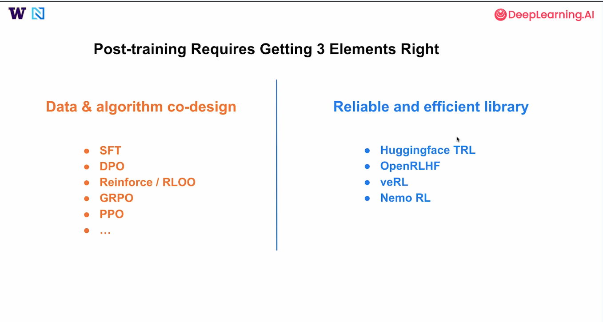 

---

## TRL 

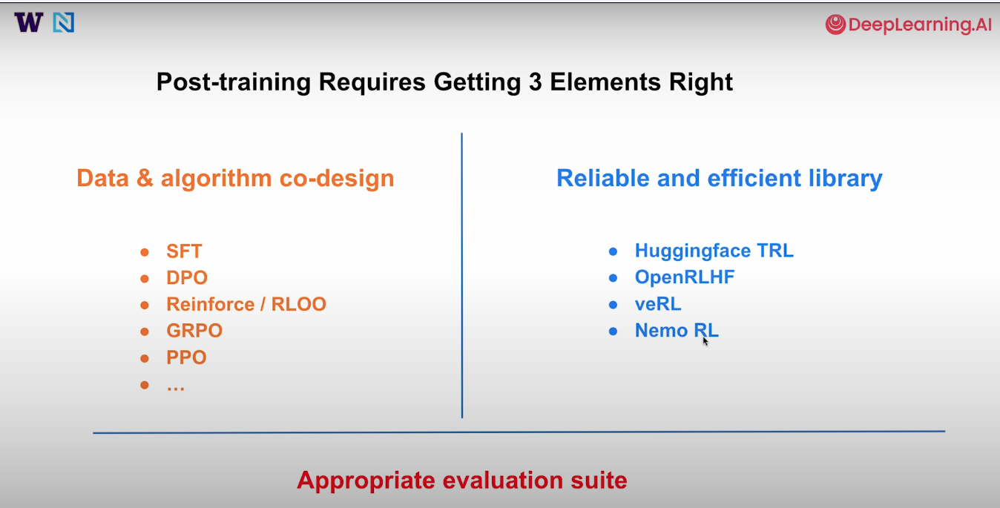 

---

## Evaluation suite

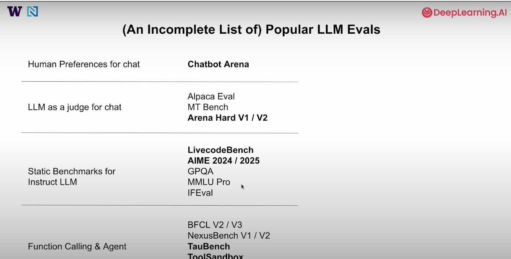 

---

## To improve

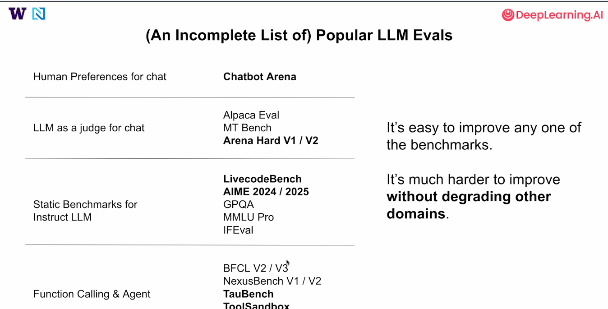 

---

## When to do post-training

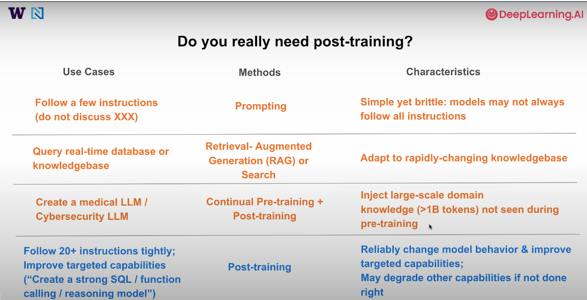 

---

## Advice

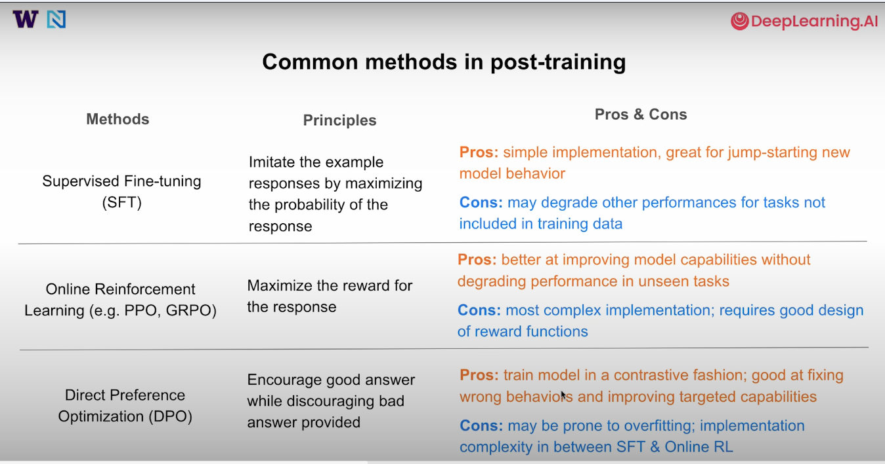 

---

## More advice

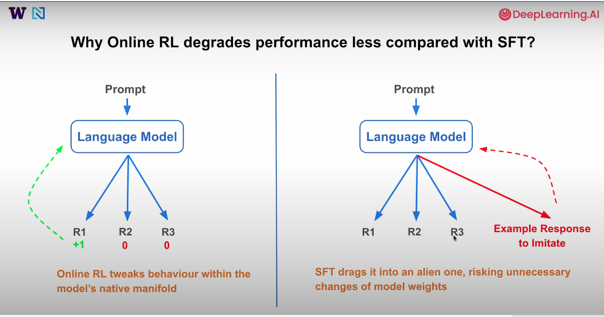 

---