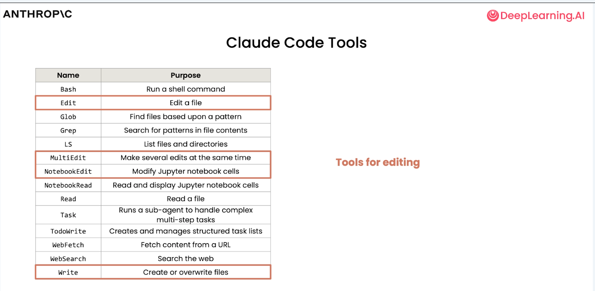
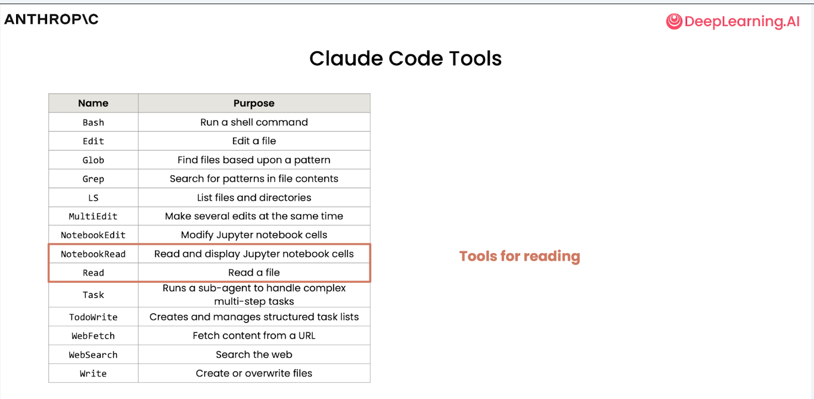
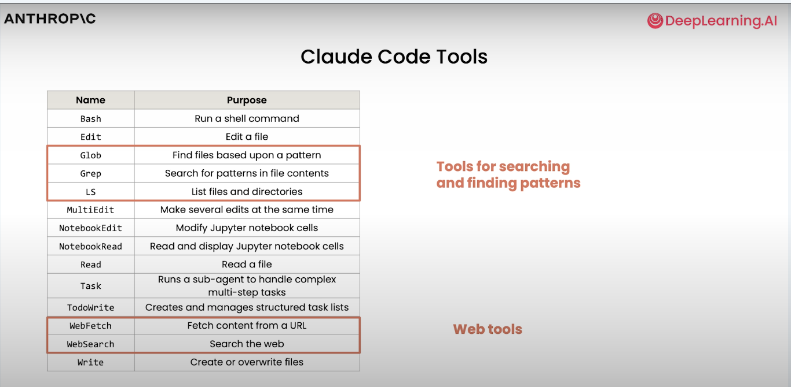
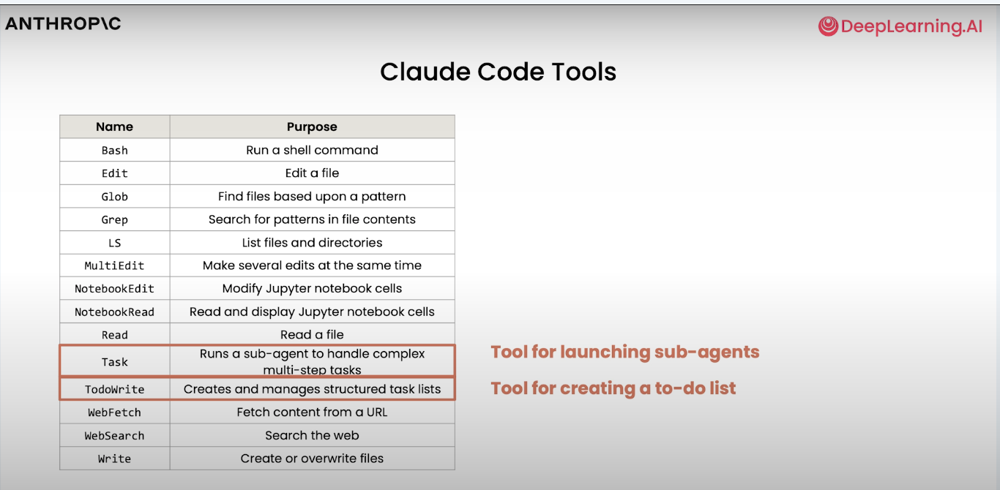
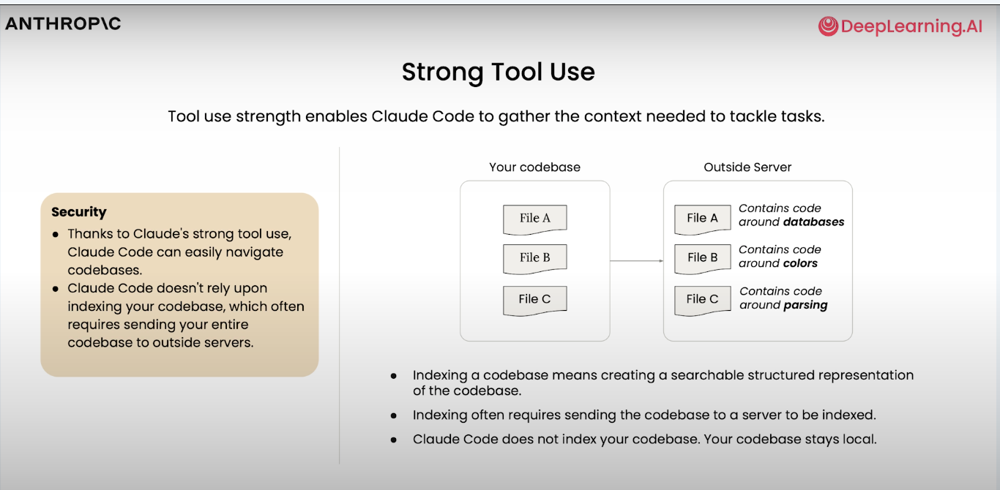
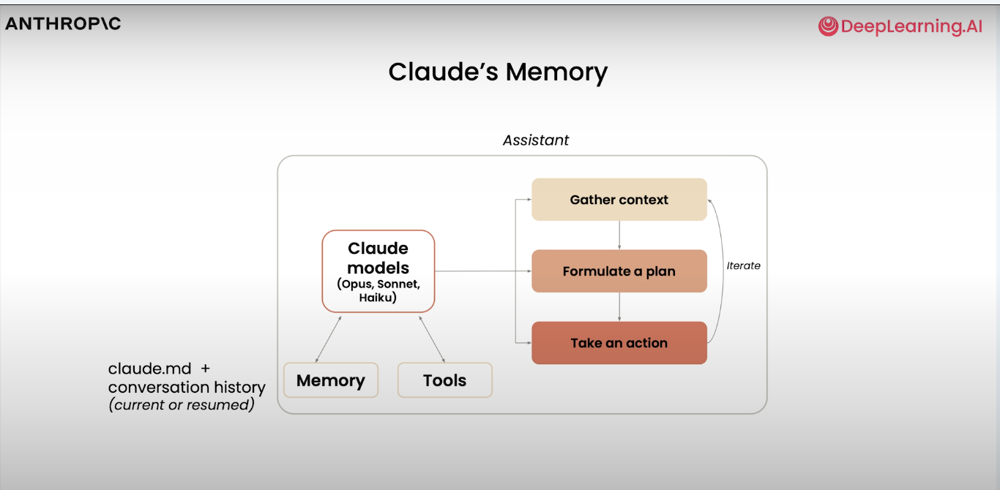
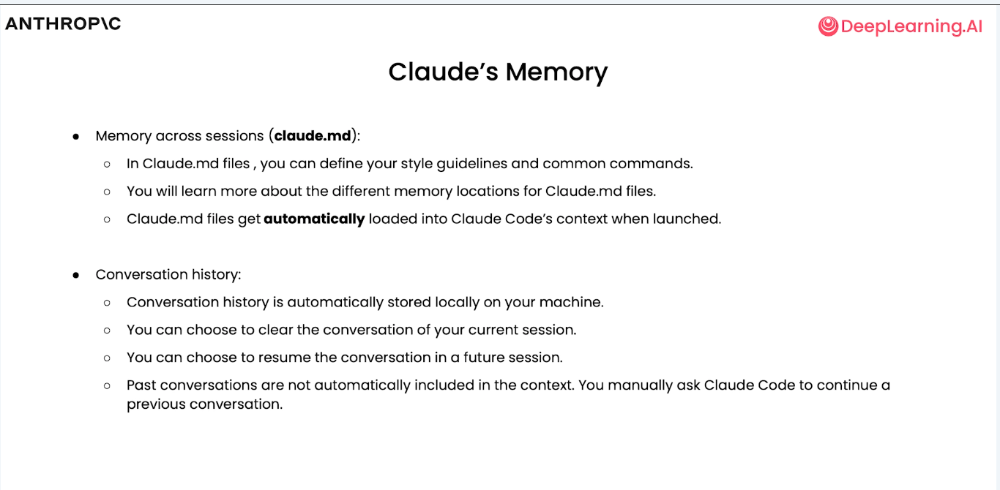
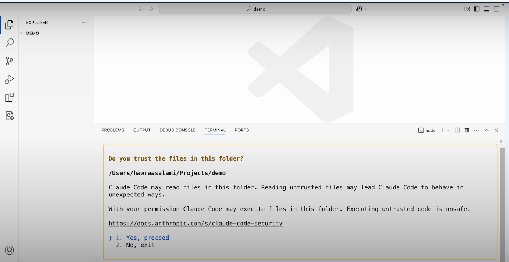
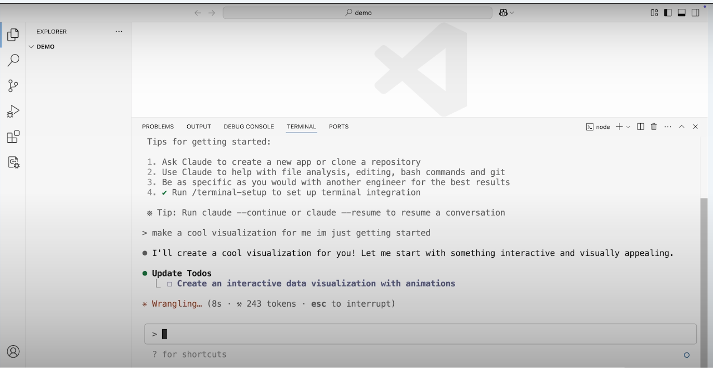

# Claude agentic intro

---

## Why agentic

 

---

## What to add to LLM

 

---

## Options

 

---

## Architecture

 

---

## Tool use

 

---

## Tools for editing

 

---

## Tools for reading

 

---

## Tools for additional actions

 

---

## More tools

 

---

## Bash tools

 

---

## Strong tool use

 

---

## Strong tool use detail

 

---

## Claude's memory

 

---

## claude.md

 

---

## Demo

 

---

## Demo

 

---