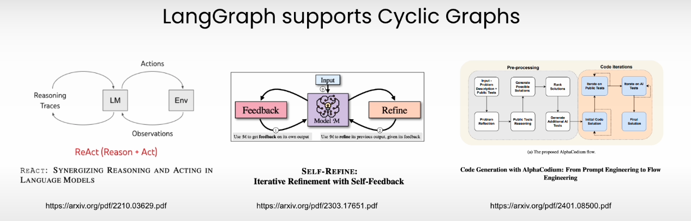
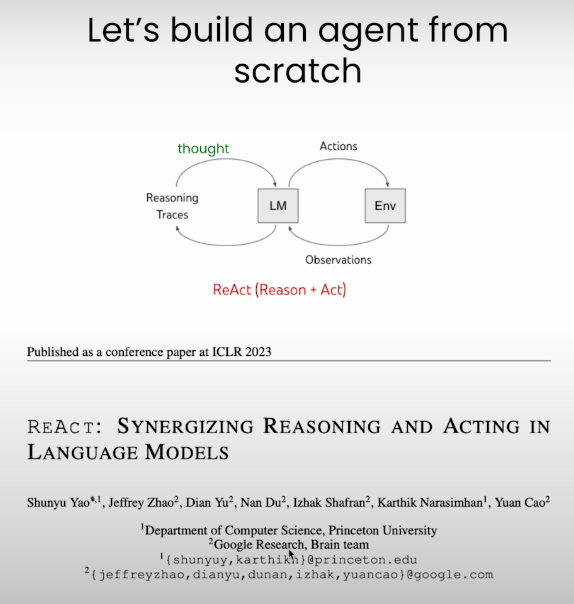
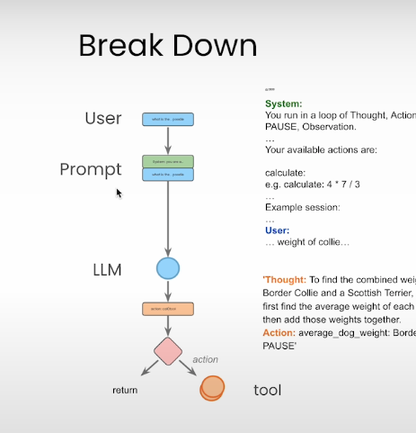
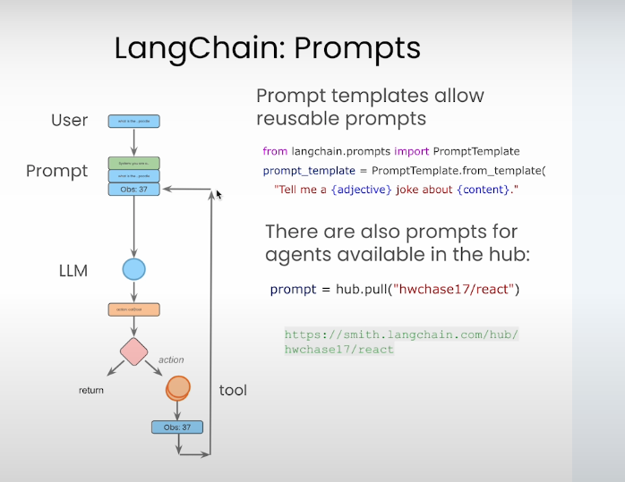
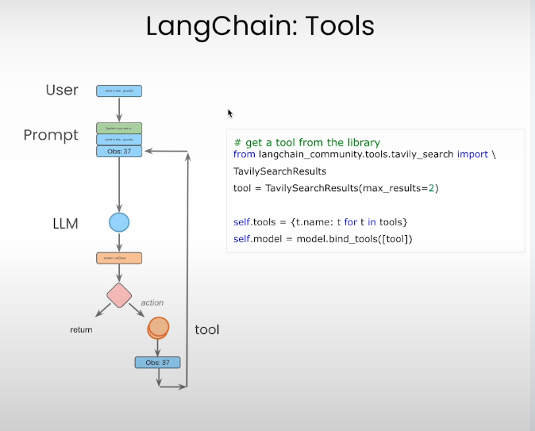
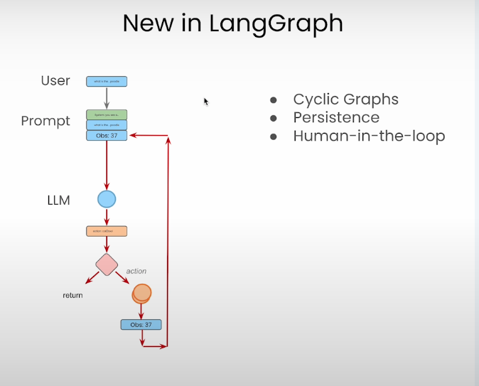
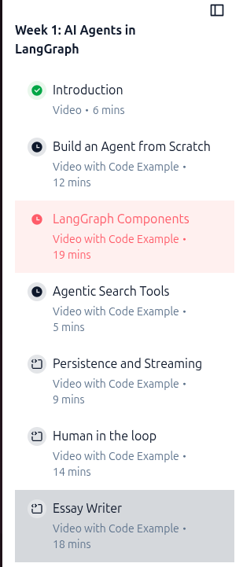

# Agentic with Langgraph

---

## What agents

 

---

## ReAct - reasoning then acting

 

* Based on [https://til.simonwillison.net/llms/python-react-pattern](https://til.simonwillison.net/llms/python-react-pattern)
---

## How we build an agent

 

---

## In Langchain

 

---

## Tools (Tavily)

 

---

## New tools in Langgraph

 

---

## Plan

 

---
