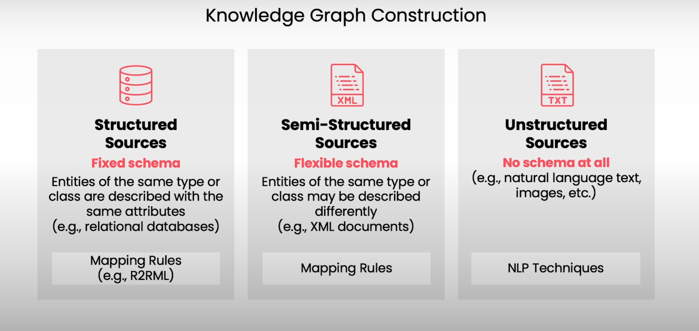
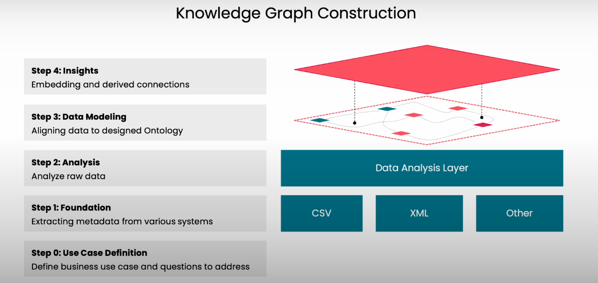

# API Discovery

---

## Roadmap

 

---

## Info for knowledge graph

 

---

## More info for knowledge graph

 

---

## Elements of a knowledge graph

 

---

## RDF

 

---

## RDF step by step

 

---

## Attributes of RDF

 

---

## More attributes of RDF

 

---

## Location attribute

 

---

## RDF serialization

 

---

## RDF serialization

 

---
## RDF serialization

 

---

## Example of RDF serialization

 

---

## How to build knowledge graphs

 

---

## 4 steps in building

 

---

## Practical use

 

---

## Where KG are useful

 

---

