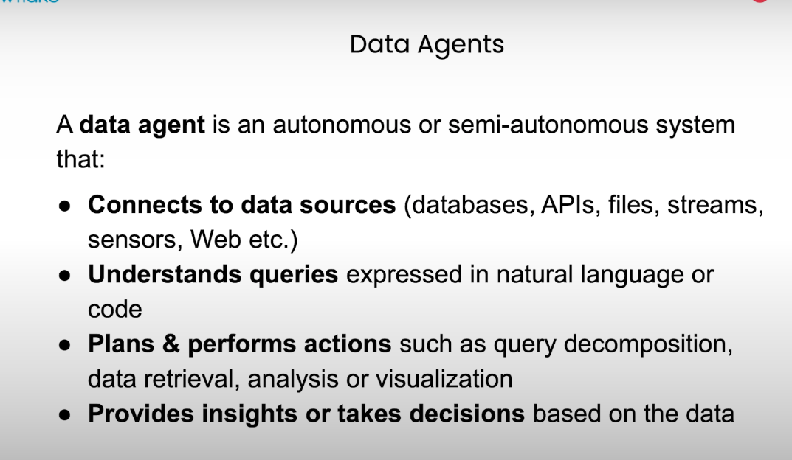
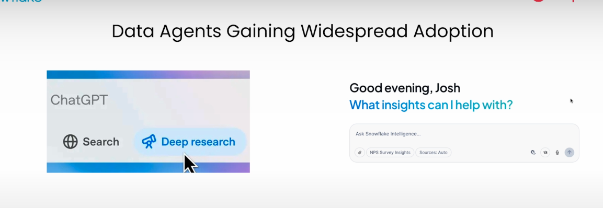

# Box MCP Server

---

## Why you need Box MCP Server

 

---

## What MCP server gives you

---

## Without the MCP, with the MCP

---

## Box's MCP server

---

## Box's MCP server complete

---

## In GitHub

* https://github.com/box-community/mcp-server-box

---