# Agentic AI

---

## Workflow

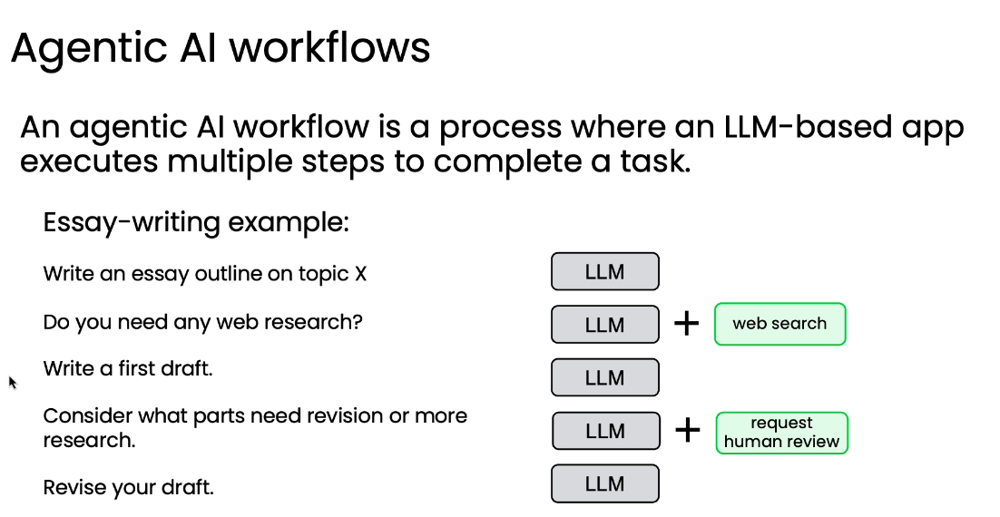 

---

## Thinking

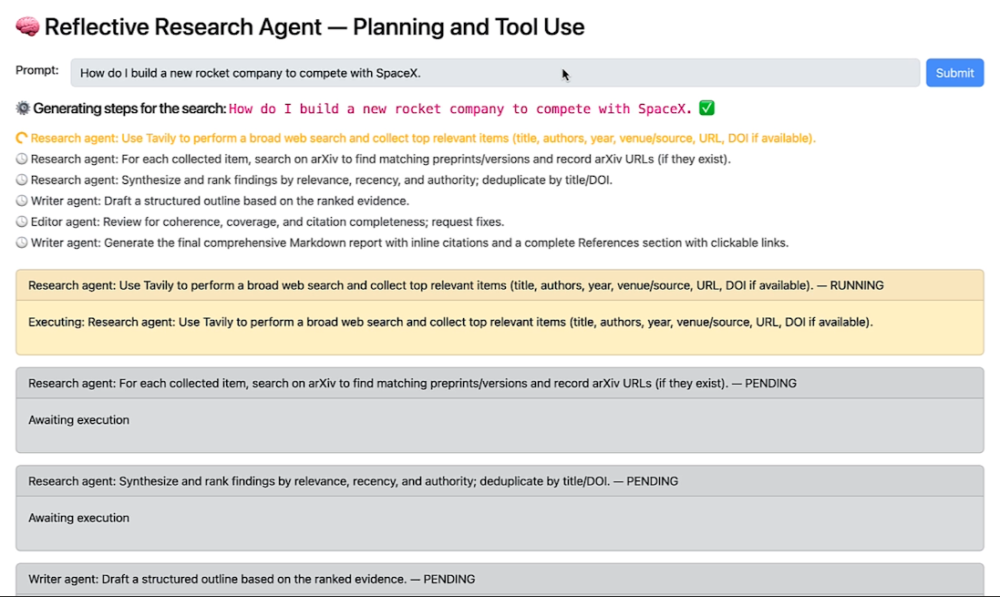

---

## Example

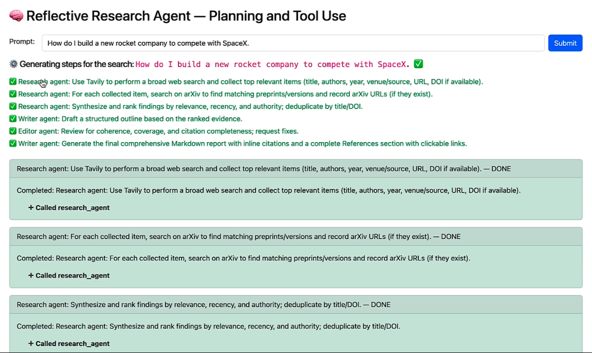   

---

## Result

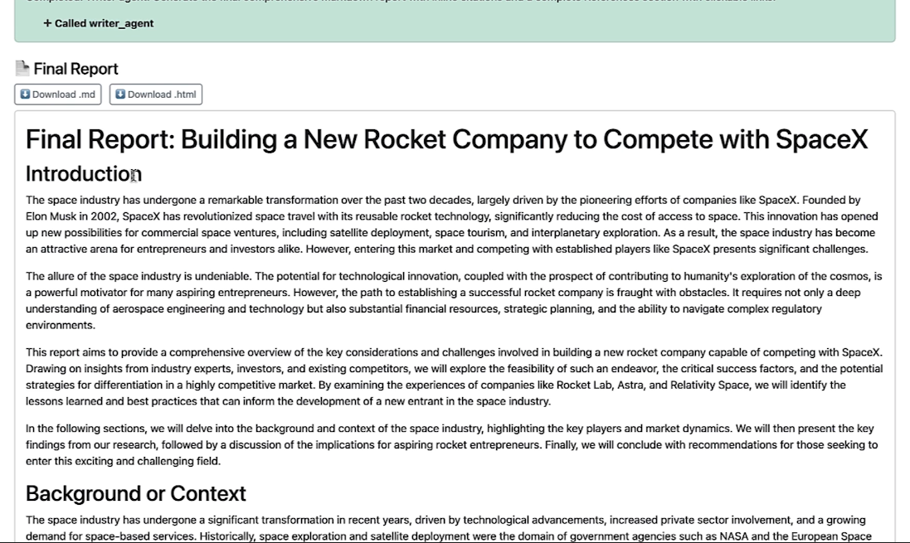

---

## Think

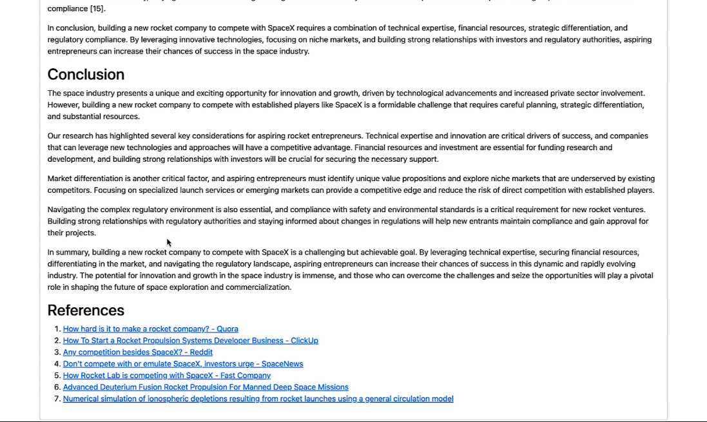

---

## Agent or Agentic

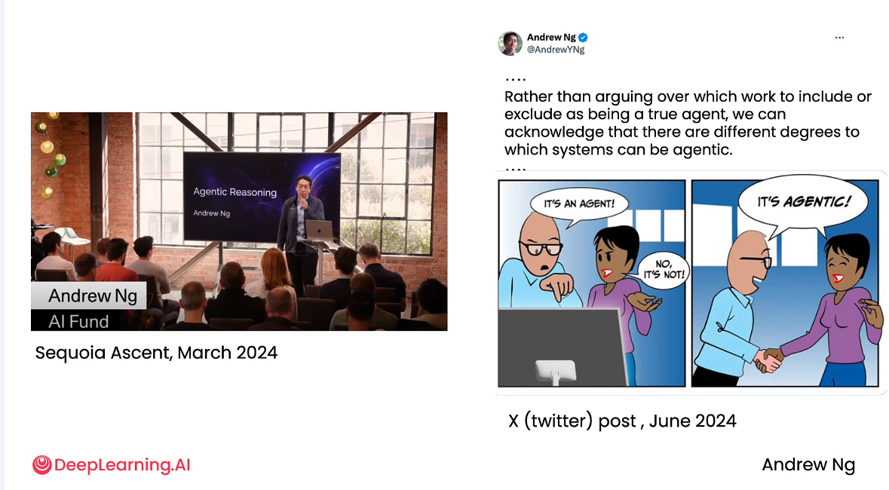

---

## Autonomy

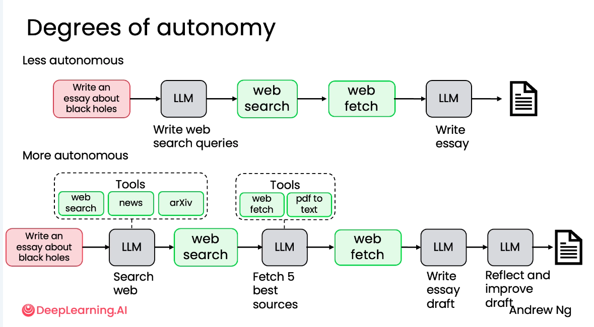

---

## Degrees of Autonomy

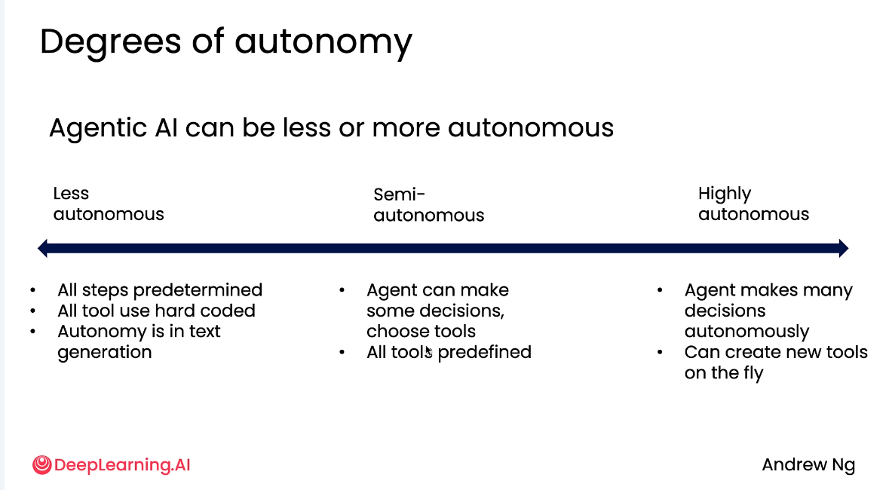

---

## Plan

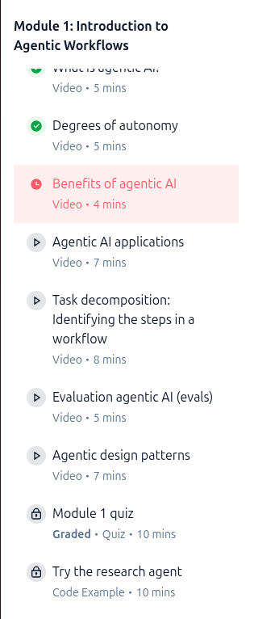

---

## GPA

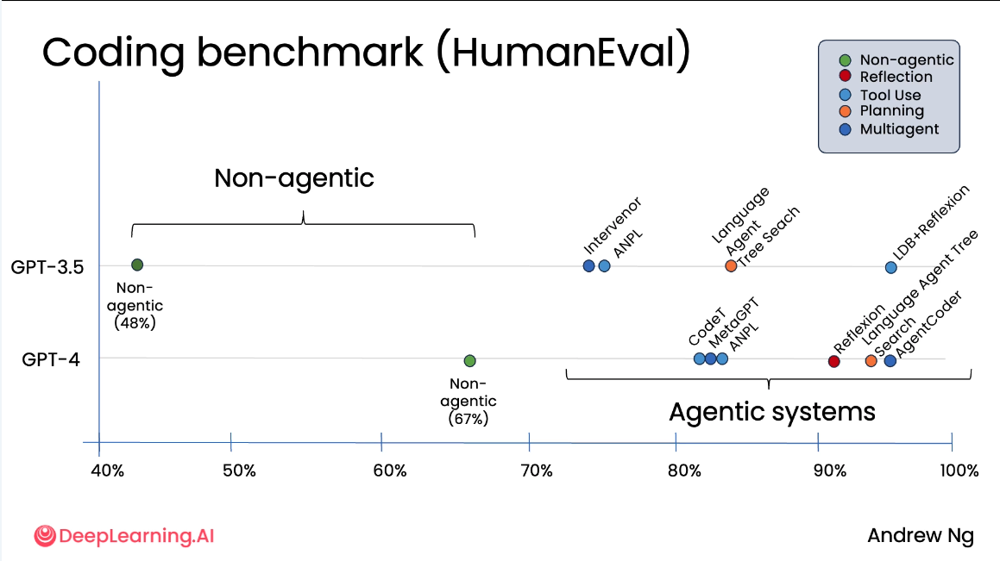

---

## How do agents work

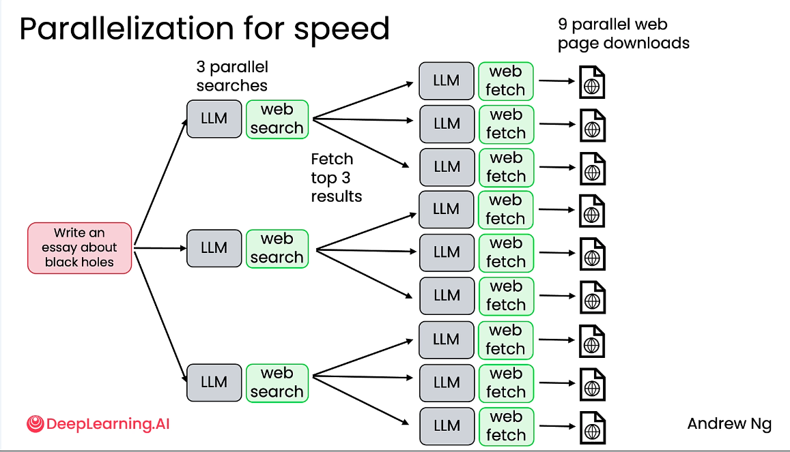

---

## How do agents work well

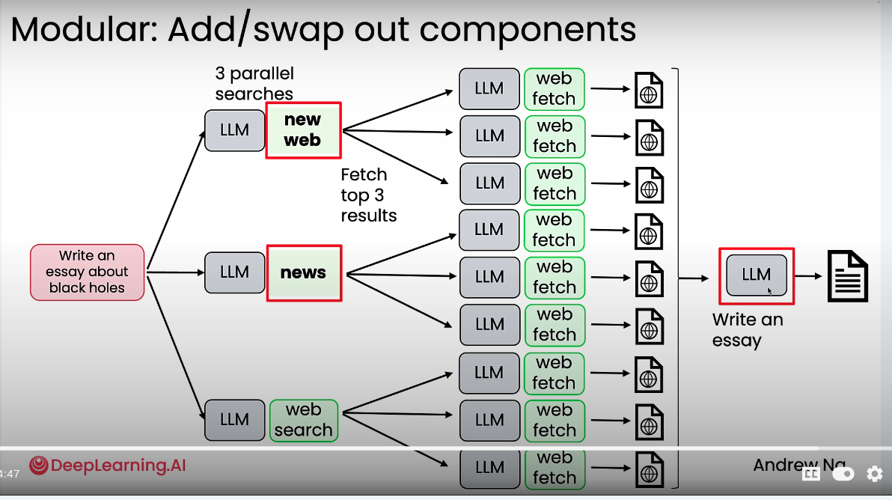

---

## What is GPA

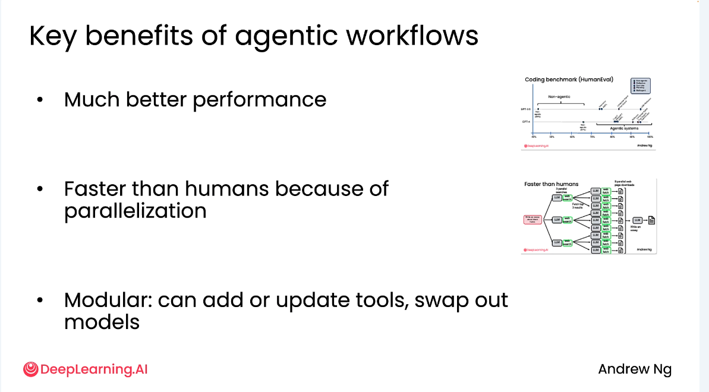

---

## What is your GPA

---

## The plan

---

# Building an agent

---

## Data agent architecture

---