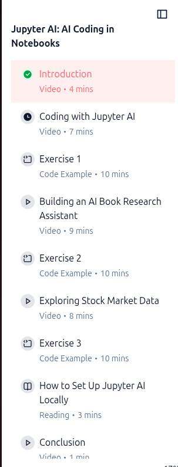
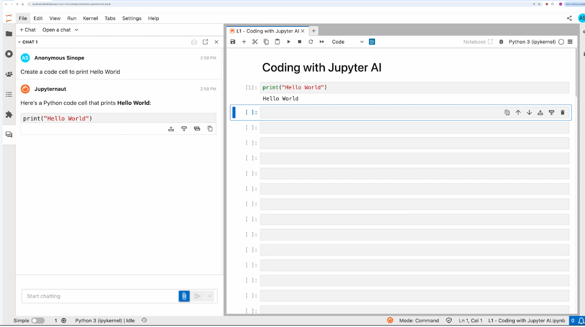
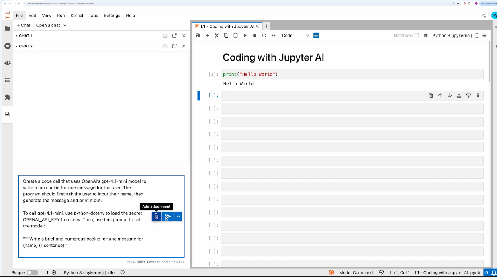
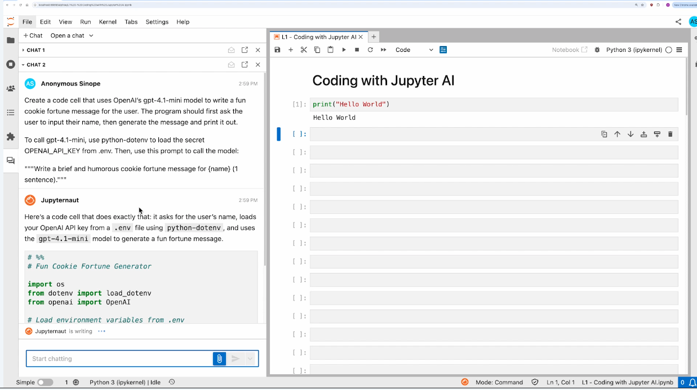
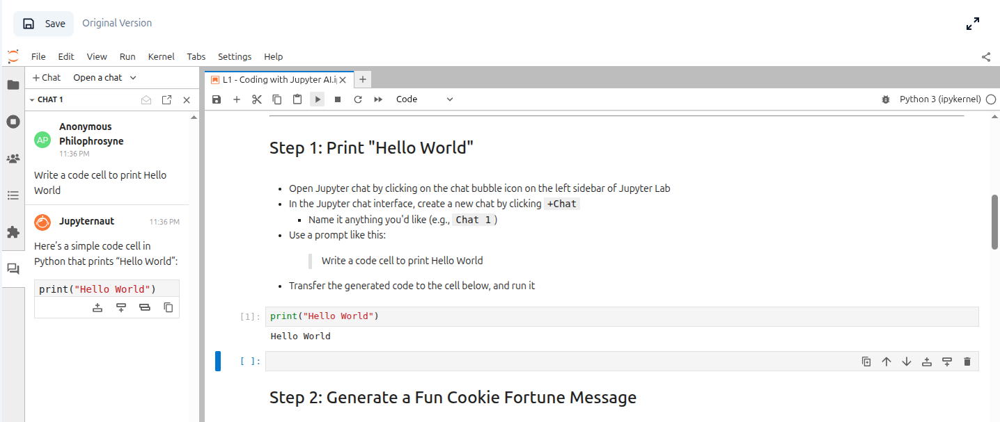

# JupyterAI

---

## What we will learn

 

---

## Example 1

 

---

## **1. Fits naturally into Jupyter workflows**
- Works directly inside JupyterLab/Notebook via `%%ai` magics and chat panel.
- Lets you call OpenAI, Anthropic, Hugging Face, Cohere, or local models.
- Open-source and part of the official Jupyter ecosystem.
- Good for:
  - Code explanations
  - Summaries
  - Generating notebooks
  - Data-analysis assistance
---

## Example 2

 

---

## Example 2 continued

 

---

## Let us try it

 

---
