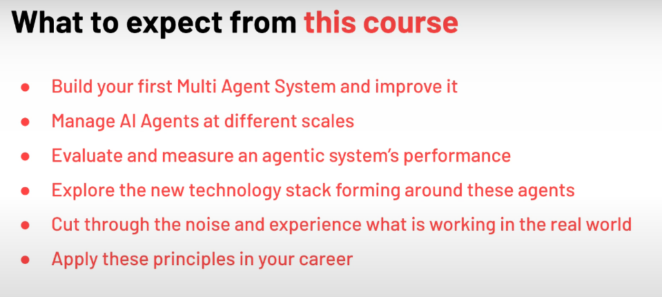
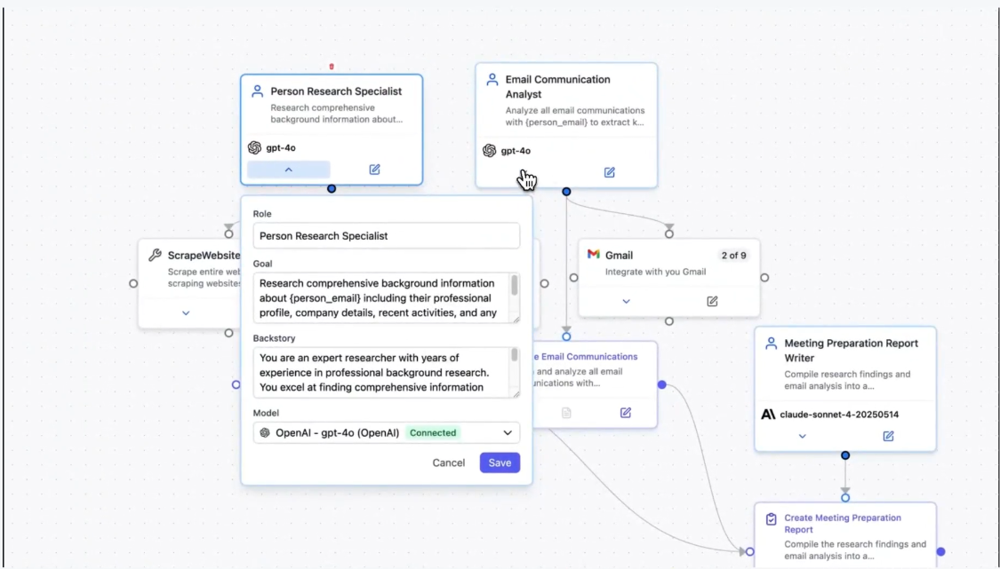
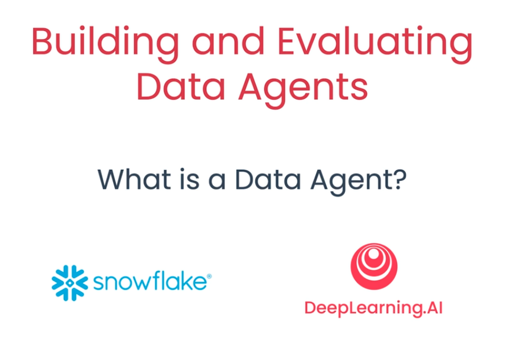
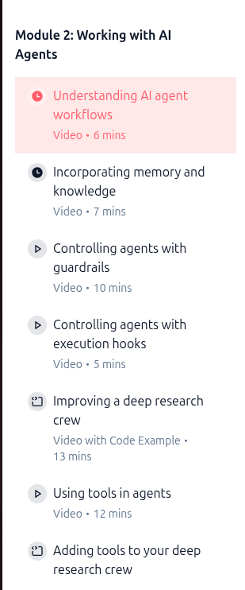
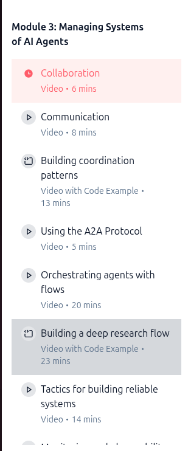
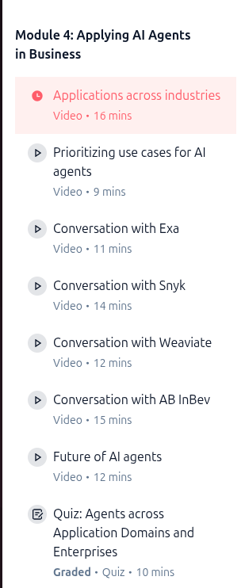

# CrewAI for Agentic

---

## 1. Immature Ecosystem (people say)
- Newer than **LangGraph** or **AutoGen**.
- Smaller community.
- Fewer real-world production deployments.
- Documentation is improving but still inconsistent.

---
## 2. Heavy Abstraction Layer (people say)
- CrewAI hides a lot of underlying logic.
- Harder to debug why agents do what they do.
- More "magic" compared to explicit frameworks.
- Developers report confusion around:
  - task delegation
  - agent memory
  - execution order

---
## 3. Workflow Complexity (people say)
- The “Crew → Agents → Tasks” model can feel restrictive.
- Simple tasks become over-engineered.
- Complex orchestrations are harder than with graph-based systems.

**Comparison:**  
- **LangGraph:** deterministic graphs with checkpoints and time-travel debugging.  
- **CrewAI:** more opaque, fewer guarantees.

---

## What to expect

---

## From zero to hero

---

## Use cases

---

## Module 1

---

## Re-Act

---

## Module 2

---

## Module 3

---

## Module 4

---