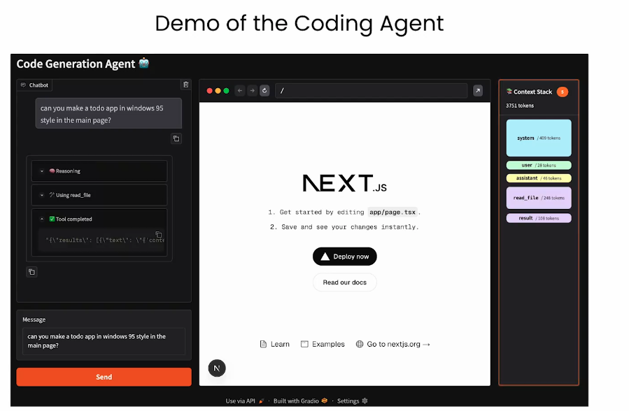
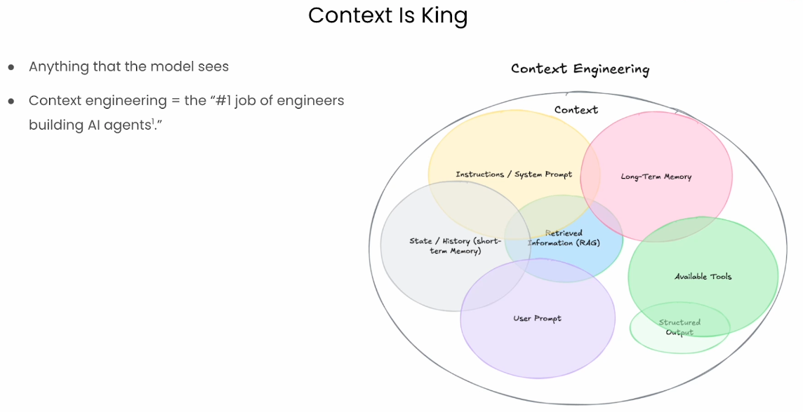
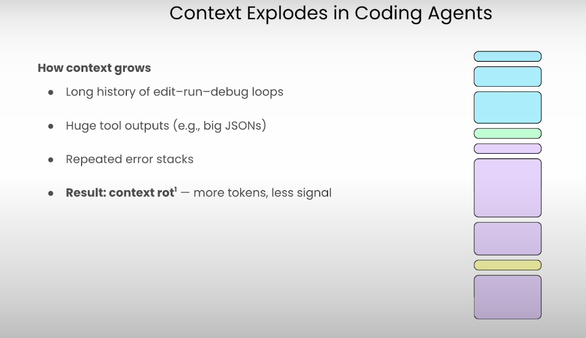
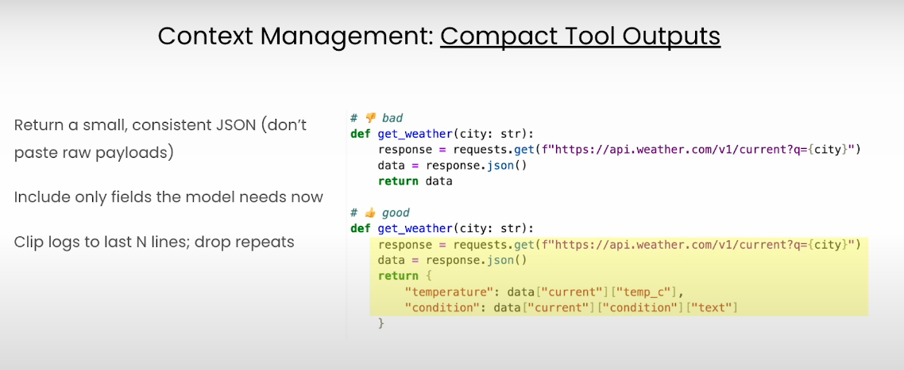
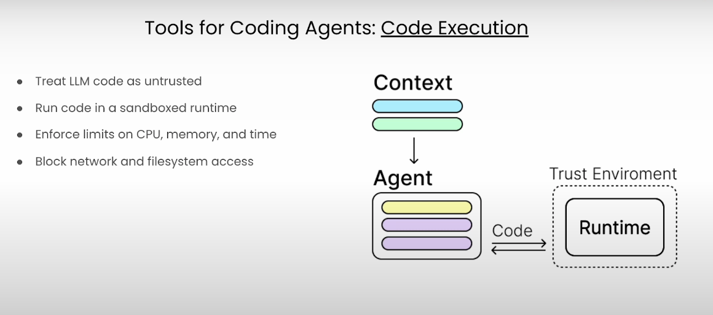
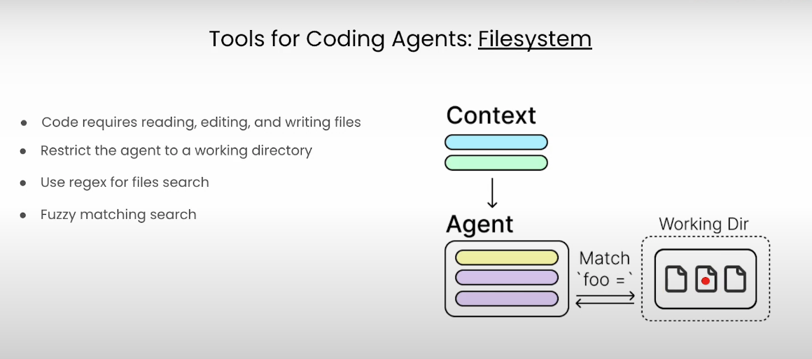
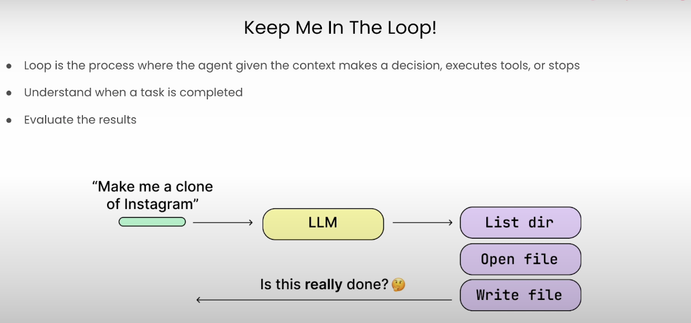
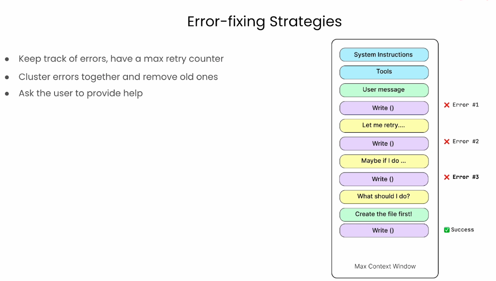

# Building Coding Agents with Tool Execution

---

## What you will learn
* How coding agents reason
* Execute code in isolated sandboxes
* Manage files
* Handle feedback loops
* Apply it to hands-on examples 
  * Like a data-analysis agent 
  * Sandboxed Next.js web app

---

## Goal: Demo

---

## What Agents do

---

## Agents specialize

---

## Choosing the right LLM

---

## SWE Bench

---

## SWE-Bench

* SWE-Bench is a benchmark created by Princeton NLP 
* Evaluate how well AI systems can solve **real-world software engineering tasks**.  
* It uses **real GitHub issues**, **real codebases**, and **actual test suites** from popular open-source Python projects.

##  Benchmark item 
- A GitHub issue description  
- Repository snapshot at the time of the issue  
- Failing test cases  
- The ground-truth patch merged by maintainers  

The AI’s job: **produce a patch that makes the tests pass**.

---

## What It Measures
SWE-Bench evaluates:
- Bug understanding  
- Reasoning inside large codebases  
- Patch generation  
- Ability to avoid regressions  
- Realistic software engineering workflows  

* It is the leading benchmark for **agentic coding systems** and LLM-based automated debugging.

---

## Why It Matters
SWE-Bench has become the **industry standard** for testing AI-as-software-engineer capabilities.  
It is used by:
- OpenAI  
- Anthropic  
- Meta  
- Google  
- Academic labs  

Results correlate strongly with real-world debugging and maintenance performance.

---

## Approximate Results (2024–2025)  
- **Human engineers:** ~80–90% (estimated)  
- **OpenAI o3:** ~50–60% (SOTA on Lite)  
- **Claude 3.7 Sonnet agent:** ~35–40%  
- **GPT-4/5 coding models:** ~20–35%  
- **Base LLMs w/out tools:** ~5–10%

* Agents dramatically outperform standalone models.

---

## Context

---

## Context engineering

---

## Context explosion

---

## Context compaction

---

## Context tricks

---

## Running rules

---

## Writing files

---

## LLM loop

---

## Don't go crazy

---

## Environment

---

