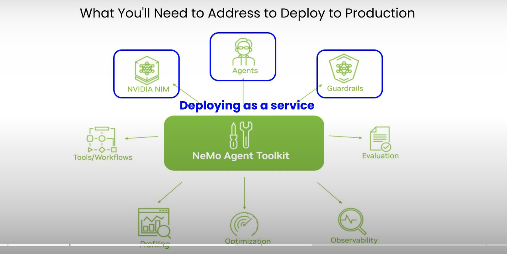

# Multi-vector Image Retrieval

---

## What you need to know

---

## Bi-encoder

---

## Cross-encoder

---

## ColBERT

---

## Query

---

## MaxSim

---

## Asymmetry

---

## In practice

* Hierarchical Navigable Small World.
---

