# NAT overview

---

## NAT

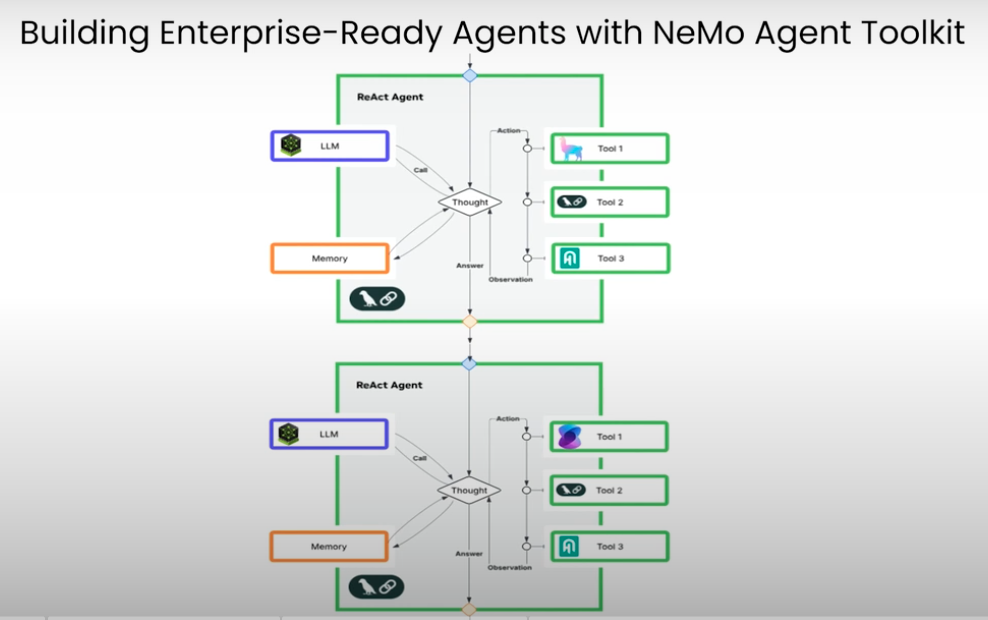

---

## POC

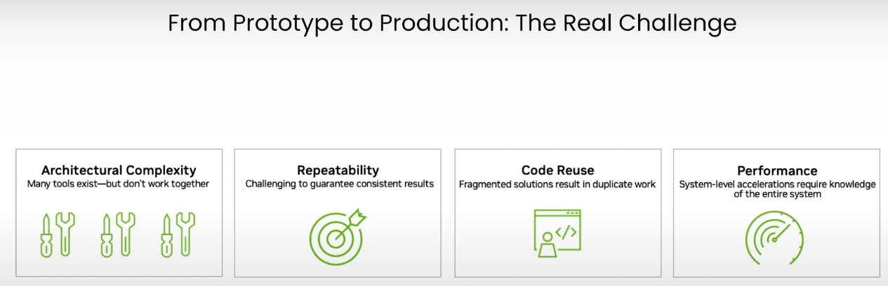

---

## Day 2

---

## Day 2 tasks

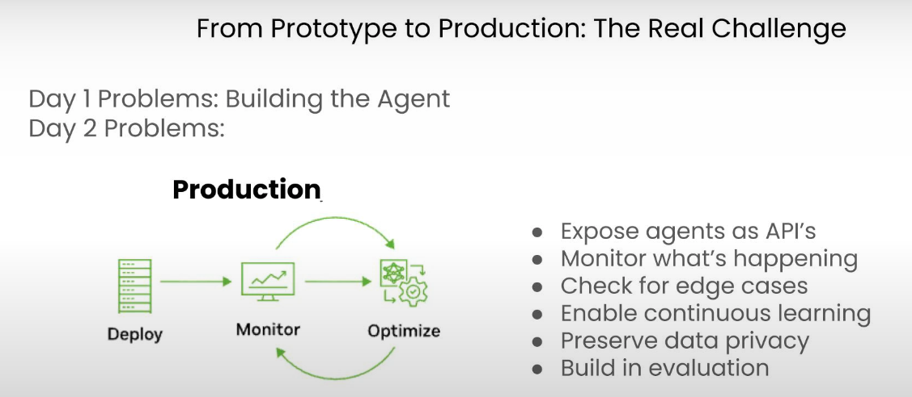

---

## NeMo

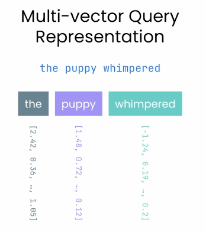

---

## Neural Modules

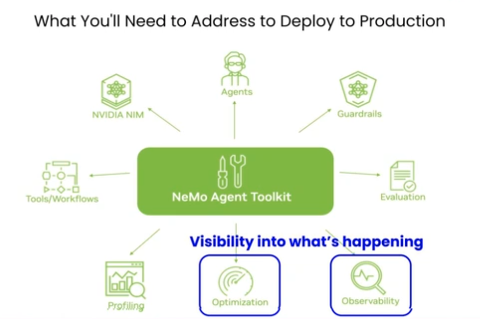

---

## Install

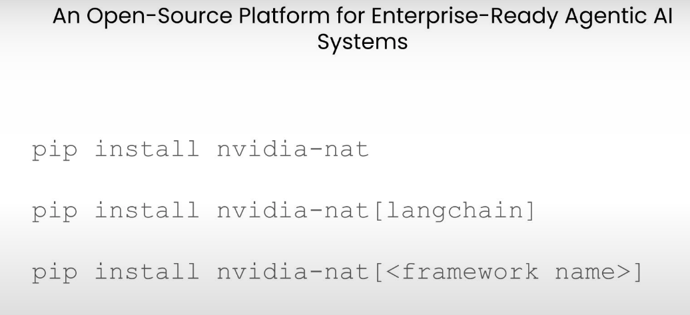

---

## Config

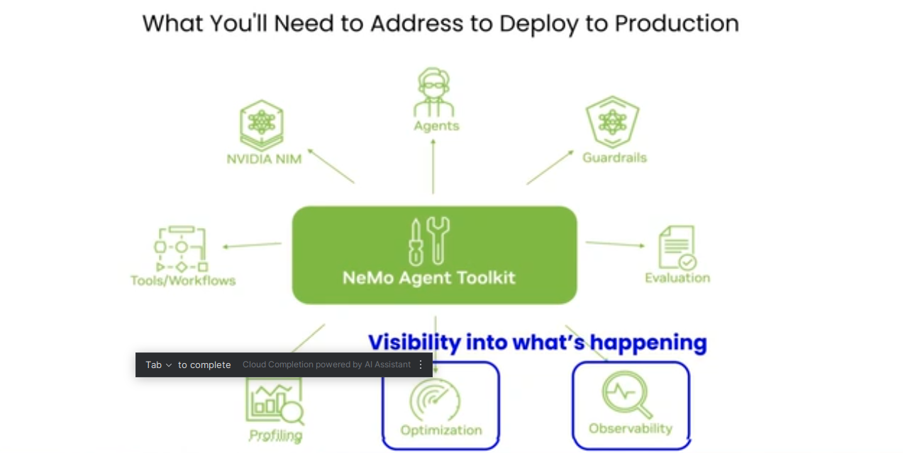
---

## Correct?

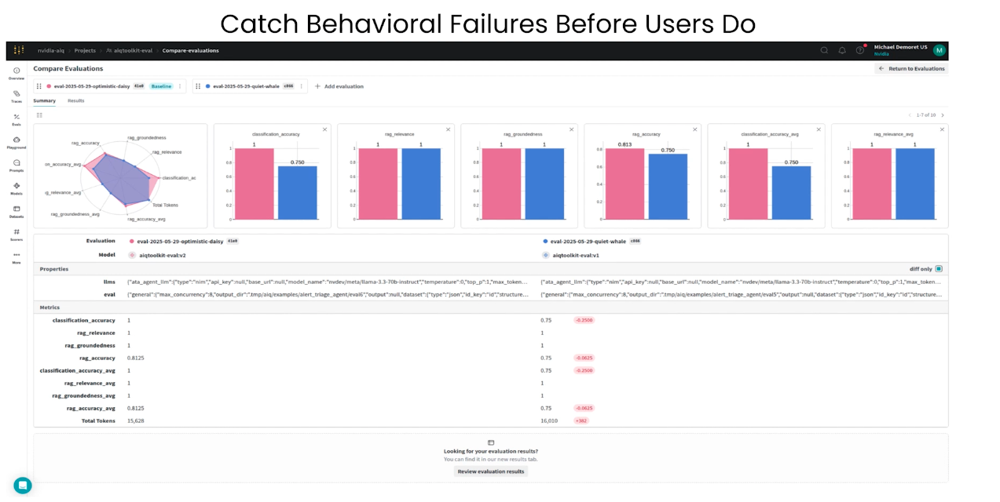
---

## Optimize

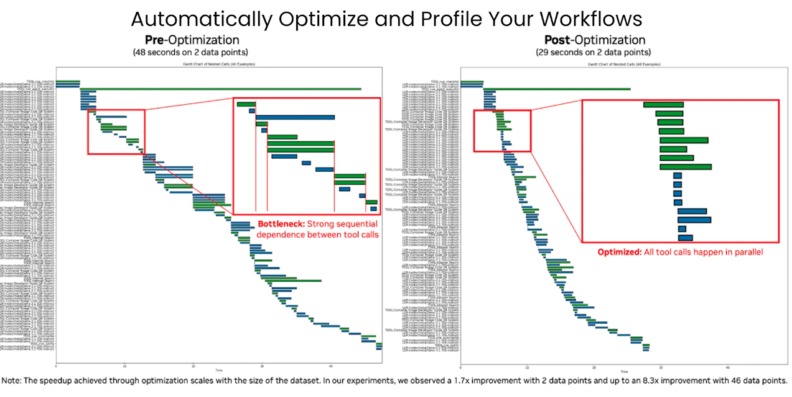
---

## Optimized

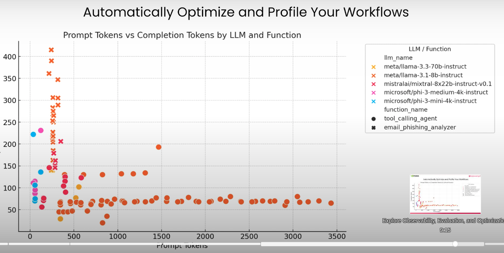
---

## Integrations

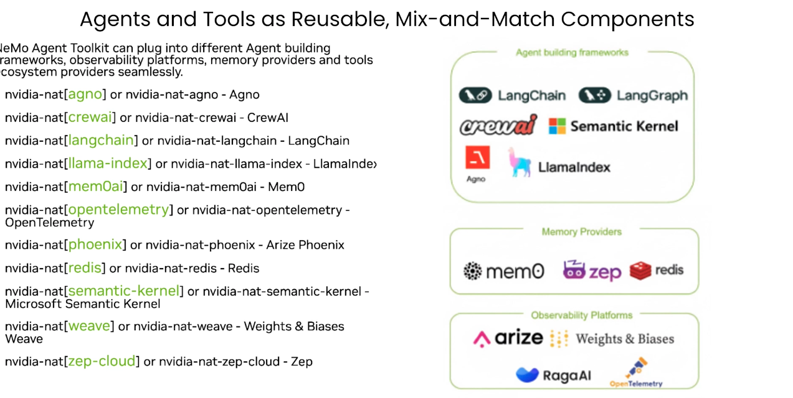
---

## Real system

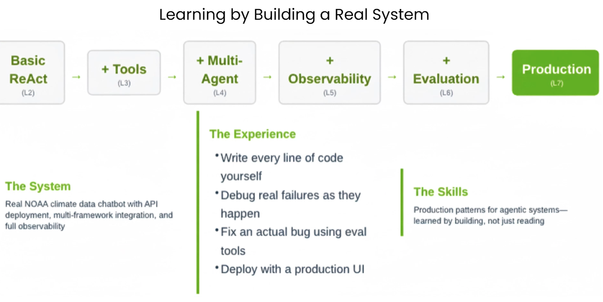
---

